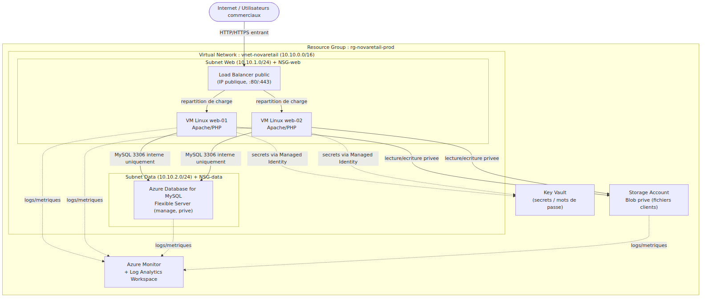
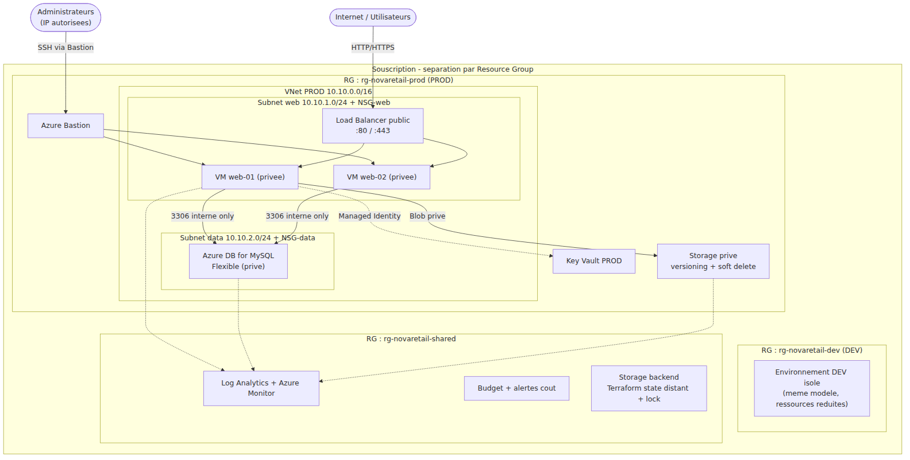
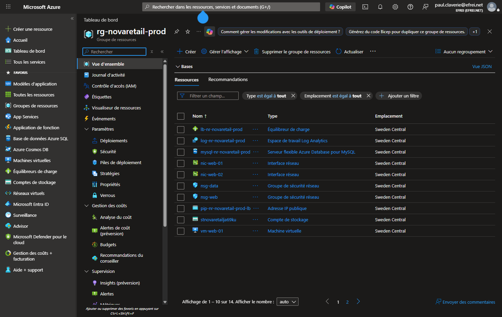
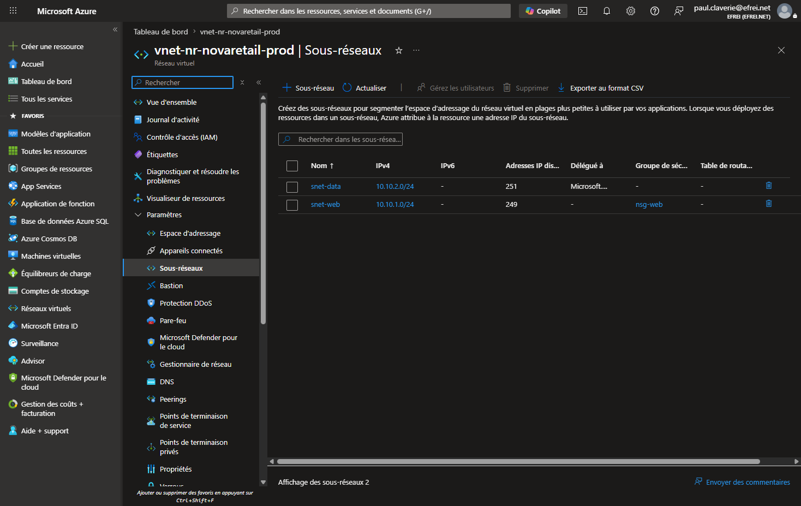
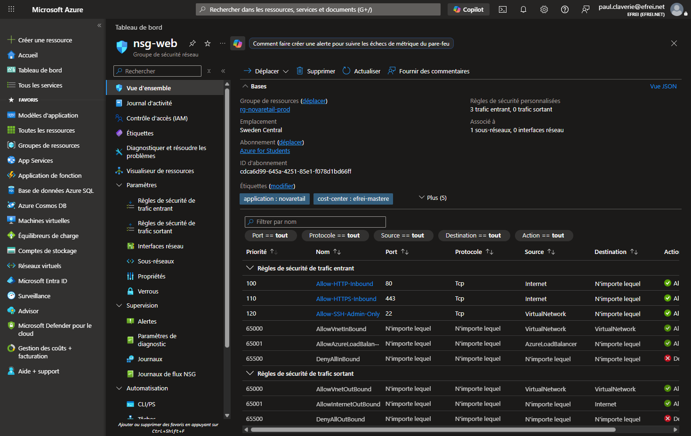
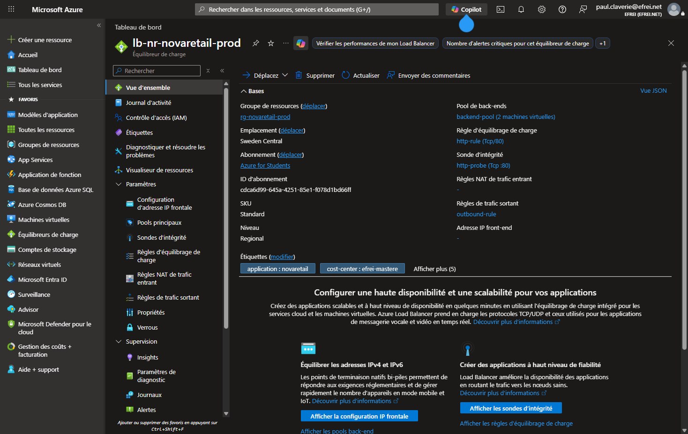
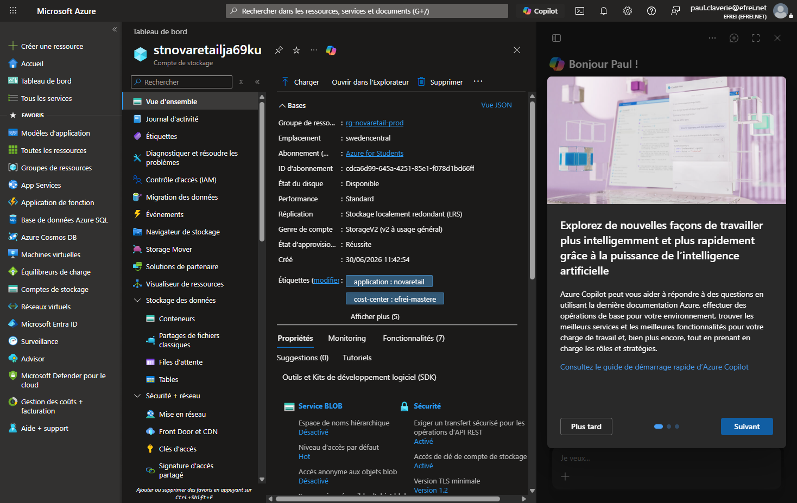
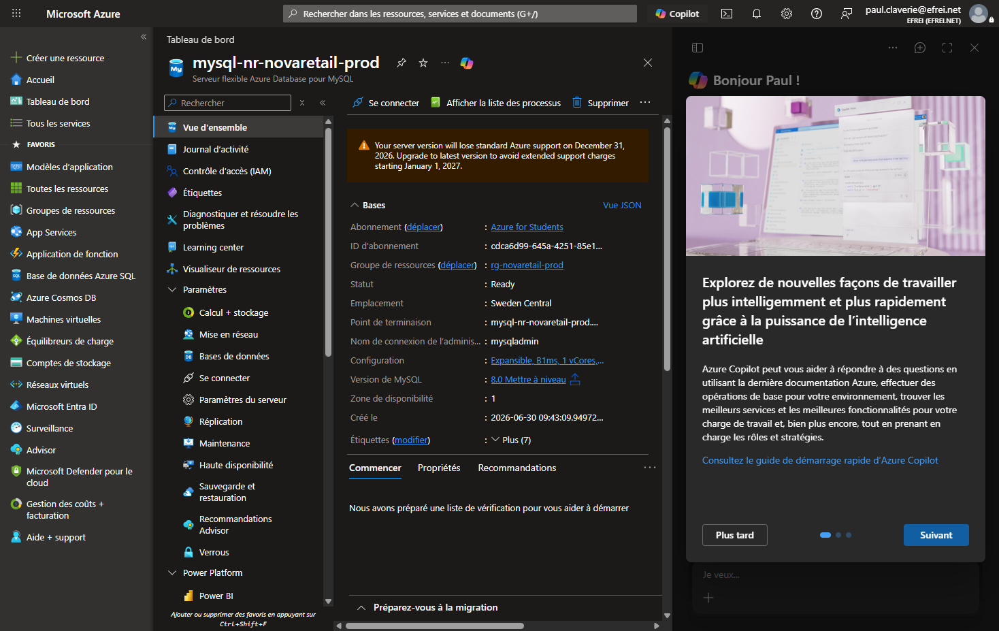
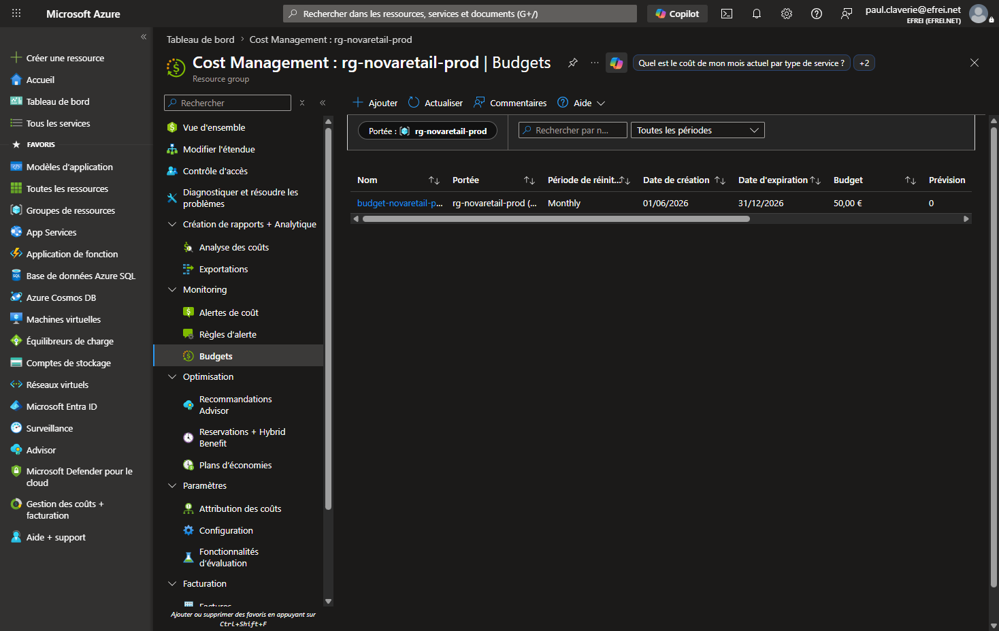

# Épreuve finale pratique — Cloud Azure

## Cas NovaRetail — Architecture, diagnostic, Terraform, administration, monitoring, FinOps, sécurité

**Auteur :** Paul Claverie — Mastère
**Souscription de déploiement :** Azure for Students — région `swedencentral`
**Date :** Juin 2026

**Infrastructure réellement déployée et validée** via Terraform (captures du portail Azure intégrées).

Ce dossier répond à l'intégralité de l'épreuve : analyse de l'existant et architecture cible (Partie 1),
diagnostic d'une architecture défectueuse (Partie 2), déploiement Infrastructure as Code avec preuves
(Partie 3), administration et automatisation (Partie 4), monitoring / FinOps / sécurité (Partie 5)
et questions théoriques dont la traçabilité blockchain (Partie 6).


<div class="page-break"></div>

# Partie 1 — Analyse de l'existant et architecture cible

> **Cas NovaRetail** — migration d'une application web de gestion de commandes (serveur Linux unique on-premise) vers Microsoft Azure.
> **Barème : 3 pts** — pertinence de l'analyse, choix des services, schéma cohérent, justification des flux.

---

## Question 1 — Analyse de l'existant

L'architecture actuelle repose sur un **serveur Linux unique** hébergeant à la fois le serveur web Apache/PHP, la base MySQL et les fichiers clients. Cette concentration crée un **point de défaillance unique (SPOF)** et cumule les risques sur tous les domaines.

| Domaine | Risque identifié | Impact possible sur le SI |
|---|---|---|
| **Disponibilité** | Serveur unique = point de défaillance unique (SPOF). Aucune redondance, aucune répartition de charge. | Toute panne matérielle, coupure réseau ou maintenance entraîne une **indisponibilité totale** de l'application et l'arrêt de l'activité commerciale. |
| **Sécurité** | Accès administrateur partagé entre plusieurs personnes (pas de comptes nominatifs), aucune traçabilité, application + données + fichiers sur la même machine exposée. | **Aucune imputabilité** des actions, surface d'attaque élevée, risque de compromission complète (web, base et fichiers clients en un seul point) et fuite de données personnelles (RGPD). |
| **Performance** | Toutes les couches (web, base, stockage) partagent les mêmes ressources CPU/RAM/disque. Aucune capacité de montée en charge (scalabilité). | **Contention de ressources** : un pic de trafic web dégrade la base et inversement. Impossible d'absorber la croissance des équipes commerciales. |
| **Exploitation** | Pas de supervision ni de tableau de bord, administration manuelle, aucune Infrastructure as Code. | **Détection tardive** des incidents (panne constatée par les utilisateurs), diagnostic difficile, exploitation chronophage et non reproductible. |
| **Coûts** | Aucune estimation précise des coûts d'exploitation, pas de modèle de facturation clair (électricité, maintenance, amortissement matériel). | **Pilotage budgétaire impossible**, coûts cachés (énergie, remplacement matériel), pas d'arbitrage possible entre dépense et valeur. |
| **Sauvegarde** | Sauvegarde manuelle hebdomadaire, sur le même serveur ou à proximité, sans test de restauration. | **Perte de données pouvant atteindre 7 jours** (RPO élevé), risque de perte totale en cas de sinistre physique (les sauvegardes ne sont pas isolées), restauration non garantie. |

**Synthèse :** l'existant cumule un SPOF total, une sécurité non maîtrisée et une absence de supervision et de stratégie de sauvegarde fiable. La migration vers Azure doit prioritairement **séparer les couches**, **introduire de la redondance** et **industrialiser l'exploitation**.

---

## Question 2 — Choix des services Azure

Pour chaque besoin, le service est choisi selon les cinq critères de l'épreuve : **coût, sécurité, performance, disponibilité, exploitabilité**.

| Besoin | Service Azure proposé | Justification |
|---|---|---|
| **Hébergement applicatif** | **Machines virtuelles Linux** (VM Scale Set ou 2 VM identiques) derrière un répartiteur de charge | Le sujet impose explicitement « deux machines virtuelles Linux ». Deux VM réparties permettent la **haute disponibilité** (si une tombe, l'autre sert le trafic) et conservent la compatibilité Apache/PHP existante (migration « lift & shift » à faible risque). |
| **Réseau isolé** | **Azure Virtual Network (VNet)** avec subnets dédiés | Isole les ressources dans un réseau privé, permet la **segmentation** (web / données) et le contrôle fin des flux. Aucune ressource n'est exposée par défaut. Service gratuit (on ne paie que le trafic sortant). |
| **Filtrage réseau** | **Network Security Group (NSG)** par subnet | Filtrage stateful niveau 3/4 : on n'autorise que les flux nécessaires (HTTP/HTTPS entrant vers le web, MySQL **uniquement** depuis le subnet web vers la base, SSH restreint). Gratuit et indispensable à la sécurité. |
| **Stockage de documents** | **Azure Storage Account (Blob privé)** | Stockage objet **durable et redondant** (LRS/ZRS), découplé des VM (les fichiers clients ne sont plus sur le serveur applicatif). Accès privé, chiffrement au repos par défaut, versioning et soft delete activables. Coût très faible au Go. |
| **Base de données managée** | **Azure Database for MySQL — Flexible Server** | Remplace la base MySQL sur VM par un **service managé** : sauvegardes automatiques, patching, haute disponibilité zone-redondante, chiffrement, supervision intégrée. Décharge l'équipe de l'administration de la base et améliore disponibilité + sécurité. |
| **Supervision** | **Azure Monitor** (métriques + alertes) | Collecte centralisée des métriques (CPU, disponibilité, latence), création d'alertes et de tableaux de bord. Comble l'absence totale de supervision de l'existant. Facturation à l'usage. |
| **Gestion des coûts** | **Microsoft Cost Management + Budgets** | Suivi des dépenses par ressource/tag, **budgets avec alertes** de dépassement. Répond au besoin « mieux maîtriser les coûts » et au pilotage FinOps. Gratuit. |
| **Gestion des droits** | **Microsoft Entra ID + RBAC** (rôles intégrés, moindre privilège) | Remplace l'accès admin partagé par des **comptes nominatifs** et des rôles minimaux (Reader, Contributor ciblé, pas d'Owner généralisé). Apporte imputabilité et séparation des responsabilités. |
| **Journalisation / audit** | **Log Analytics Workspace + Azure Activity Log + diagnostic settings** | Centralise les journaux (système, accès, modifications de ressources via Activity Log), permet des requêtes KQL, l'audit et la corrélation. Support des alertes et de l'analyse a posteriori. |

> **Note FinOps / compte Azure for Students :** dans le déploiement réel (Partie 3), l'**Application Gateway** (≈ 125 $/mois) est remplacée par un **Load Balancer standard** (≈ 18 $/mois) — le sujet autorise « un Load Balancer **ou** une Application Gateway ». Les VM visaient une taille burstable `Standard_B1s` ; la famille `B` étant en restriction de capacité à swedencentral, le déploiement réel utilise `Standard_D2s_v3` (variable `vm_size` ajustable). Ces arbitrages coût/fonctionnalité sont assumés et documentés.

---

## Question 3 — Architecture cible

### Schéma d'architecture cible



> Le schéma exporté en PNG/PDF figure dans `schemas/` et `screenshots/` pour le rendu final.

### Description des flux

| Type de flux | Description | Contrôle |
|---|---|---|
| **Entrant** | Internet → Load Balancer (HTTP `:80`, HTTPS `:443`) → VM web | NSG-web : autorise `80/443` depuis Internet vers le subnet web uniquement. |
| **Interne (web → data)** | VM web → MySQL (`3306`) | NSG-data : autorise `3306` **uniquement** depuis le subnet web. Aucune exposition Internet. |
| **Interne (web → stockage)** | VM web → Storage Account (Blob privé) | Accès via endpoint privé / identité managée, pas d'accès public aux blobs. |
| **Administration** | Admin → VM via SSH (`22`) | NSG-web : SSH restreint à une plage d'IP d'administration connue (ou Azure Bastion), **jamais** `0.0.0.0/0`. |
| **Sortant / supervision** | VM, MySQL, Storage → Log Analytics / Azure Monitor | Diagnostic settings envoient métriques et journaux vers le workspace. |
| **Secrets** | VM → Key Vault | Lecture des secrets (mot de passe BDD) via **Managed Identity**, aucun secret en clair. |

### Justification courte des principaux choix

1. **Deux VM derrière un Load Balancer** : supprime le SPOF de l'existant et apporte la haute disponibilité exigée par la direction, tout en restant compatible avec l'application Apache/PHP actuelle.
2. **Base de données managée (Azure DB for MySQL Flexible)** : externalise la base de la VM, automatise sauvegardes et patching, et améliore sécurité et disponibilité sans surcharge d'exploitation.
3. **Segmentation réseau (2 subnets + NSG)** : sépare la couche web exposée de la couche données protégée ; la base n'est jamais accessible depuis Internet.
4. **Stockage Blob privé** : découple les fichiers clients du serveur applicatif, avec durabilité, chiffrement et accès privé.
5. **Azure Monitor + Log Analytics** : introduit la supervision et la traçabilité absentes de l'existant.
6. **Entra ID + RBAC + Key Vault** : remplace l'accès admin partagé par des comptes nominatifs à moindre privilège et sécurise les secrets.


<div class="page-break"></div>

# Partie 2 — Diagnostic d'une architecture défectueuse

> Audit de l'architecture proposée par un prestataire externe pour NovaRetail, **avant mise en production**.
> **Barème : 3 pts** — identification des anomalies, priorisation, corrections proposées, plan de vérification.

---

## Question 4 — Identification des anomalies

Analyse des 18 caractéristiques de l'architecture proposée. **18 anomalies** identifiées (le sujet en demande au moins 12), classées par domaine : sécurité, disponibilité, exploitation, FinOps, gouvernance, Infrastructure as Code (IaC).

| No | Anomalie identifiée | Domaine | Risque principal |
|---|---|---|---|
| 1 | Un seul Resource Group `rg-prod-novaretail` mélange DEV et PROD | Gouvernance | Pas d'isolation des environnements : une erreur en DEV impacte la PROD, gestion des droits et du cycle de vie impossible. |
| 2 | Aucune séparation entre environnement de test et de production | Gouvernance | Tests destructeurs possibles sur la PROD, pas de promotion contrôlée des changements. |
| 3 | VNet unique `10.0.0.0/24` avec un seul subnet | Disponibilité / Sécurité | Aucune segmentation : web et base sur le même réseau, propagation latérale d'une compromission, plan d'adressage trop étroit (254 IP). |
| 4 | Les deux VM Linux ont une adresse IP publique | Sécurité | Surface d'attaque directe sur Internet, contournement de tout point d'entrée contrôlé. |
| 5 | Port SSH (`22`) ouvert depuis `0.0.0.0/0` | Sécurité | Exposition au brute-force et aux scans Internet, risque de prise de contrôle des VM. |
| 6 | Les deux VM web ne sont pas derrière un Load Balancer | Disponibilité | Pas de répartition de charge ni de bascule : SPOF persistant, pas de haute disponibilité réelle. |
| 7 | Base MySQL installée sur une VM dans le même subnet que le web | Sécurité / Disponibilité | Pas d'isolation des données, base non managée (pas de sauvegarde/patch auto), compromission web = accès direct base. |
| 8 | Port MySQL `3306` accessible depuis Internet | Sécurité | Exposition directe de la base de données : exfiltration ou destruction des données clients. |
| 9 | Mots de passe admin stockés dans `terraform.tfvars` versionné dans Git | Sécurité / IaC | **Fuite de secrets** : toute personne ayant accès au dépôt obtient les identifiants, historique Git impossible à purger. |
| 10 | State Terraform local sur le poste d'un administrateur | IaC | Perte du state = perte du contrôle de l'infra, pas de verrouillage (corruption si travail à plusieurs), pas de sauvegarde. |
| 11 | Storage Account autorise l'accès public aux blobs | Sécurité | Fichiers clients potentiellement accessibles publiquement : fuite de données personnelles (RGPD). |
| 12 | Versioning et soft delete désactivés sur le Storage Account | Disponibilité / Sécurité | Pas de récupération après suppression ou écrasement accidentel/malveillant des fichiers. |
| 13 | Aucune sauvegarde configurée | Disponibilité | Perte de données irréversible en cas d'incident, RPO/RTO non maîtrisés. |
| 14 | Aucun Log Analytics Workspace rattaché aux ressources | Exploitation | Pas de centralisation des journaux : diagnostic et audit impossibles. |
| 15 | Aucune alerte définie | Exploitation | Incidents détectés tardivement (par les utilisateurs), pas de réaction proactive. |
| 16 | Aucune stratégie de tags appliquée | FinOps / Gouvernance | Impossible d'attribuer les coûts, d'identifier propriétaire/criticité, gouvernance dégradée. |
| 17 | Aucun budget Azure configuré | FinOps | Pas d'alerte de dépassement : dérive budgétaire non détectée. |
| 18 | Plusieurs utilisateurs humains ont le rôle Owner sur la souscription | Sécurité / Gouvernance | Violation du moindre privilège : tout utilisateur peut tout faire (suppression, attribution de droits), pas d'imputabilité. |

---

## Question 5 — Priorisation des risques

Sélection des **5 risques les plus critiques** parmi les anomalies. La criticité combine la probabilité d'exploitation et la gravité de l'impact (fuite de données, indisponibilité, perte de contrôle).

| Risque critique | Niveau | Justification | Correction prioritaire |
|---|---|---|---|
| **Port MySQL 3306 exposé sur Internet** (anomalie 8) | **Critique** | Une base de données directement accessible depuis Internet est une cible de premier choix : scan automatisé, attaque par identifiants, exfiltration des données clients. Combiné à l'anomalie 7 (base sur VM non managée), l'impact est maximal (RGPD, perte totale de données). | Supprimer toute règle entrante `3306` depuis Internet. Placer la base dans un **subnet data isolé**, n'autoriser `3306` **que depuis le subnet web** via NSG. Migrer vers **Azure Database for MySQL Flexible Server** (privé). |
| **Secrets versionnés dans Git** (anomalie 9) | **Critique** | Les mots de passe administrateurs dans `terraform.tfvars` poussé sur Git sont exposés à tous les contributeurs et figés dans l'historique. Une fuite du dépôt = compromission immédiate de toute l'infrastructure. | Retirer `terraform.tfvars` du dépôt (`.gitignore`), **rotation immédiate** des secrets exposés, stockage dans **Azure Key Vault** + accès par **Managed Identity**. Purger l'historique Git si possible. |
| **SSH ouvert depuis 0.0.0.0/0** (anomalie 5) | **Élevé** | Toutes les VM sont attaquables en SSH depuis n'importe quelle IP mondiale : brute-force permanent, prise de contrôle possible. Aggravé par les IP publiques sur les VM (anomalie 4). | Restreindre `22` à une **plage d'IP d'administration** connue, ou supprimer l'accès SSH public au profit d'**Azure Bastion**. Retirer les IP publiques des VM. |
| **Owner multiple sur la souscription** (anomalie 18) | **Élevé** | Plusieurs Owners humains = aucune limite d'action, suppression accidentelle ou malveillante de ressources, attribution de droits incontrôlée, aucune imputabilité. | Appliquer le **moindre privilège RBAC** : un seul Owner de rupture, rôles **Contributor/Reader** ciblés par ressource, comptes nominatifs, revue d'accès périodique. |
| **Aucune sauvegarde + soft delete désactivé** (anomalies 12 et 13) | **Élevé** | En cas de panne, ransomware ou suppression accidentelle, **les données clients sont perdues définitivement**. Aucun moyen de restauration. | Activer les **sauvegardes automatiques** (Azure Backup pour VM, backups managés MySQL), **versioning + soft delete** sur le Storage Account, et **tester la restauration**. |

---

## Question 6 — Proposition d'architecture corrigée

L'architecture corrigée applique : séparation DEV/PROD, segmentation réseau, NSG adaptés, suppression des expositions Internet, base managée, secrets en Key Vault, state distant, supervision + sauvegardes + tags, et contrôle des coûts.



### Tableau des corrections par exigence

| Exigence du sujet | Correction apportée |
|---|---|
| Séparation DEV / PROD | Resource Groups distincts (`rg-novaretail-dev`, `rg-novaretail-prod`), idéalement abonnements séparés. Tags `environment`. |
| Segmentation réseau | VNet par environnement, **2 subnets** distincts (web `10.10.1.0/24`, data `10.10.2.0/24`). |
| Filtrage NSG adapté | NSG-web : `80/443` depuis Internet, `22` via Bastion uniquement. NSG-data : `3306` **uniquement** depuis subnet web. Deny par défaut. |
| Suppression expositions Internet | Retrait des IP publiques sur VM, fermeture de `3306` côté Internet, accès via Load Balancer et Bastion. |
| Base managée | Migration MySQL/VM → **Azure Database for MySQL Flexible Server** (privé, sauvegardes auto). |
| Gestion sécurisée des secrets | **Azure Key Vault** + **Managed Identity**, `terraform.tfvars` retiré de Git, rotation des secrets. |
| State Terraform distant | Backend distant **Azure Storage** avec verrouillage (lock) et chiffrement, dans `rg-novaretail-shared`. |
| Supervision, alertes, sauvegardes, tags | **Log Analytics + Azure Monitor**, alertes CPU/dispo/coût, **Azure Backup** + soft delete + versioning, stratégie de tags appliquée. |
| Contrôle des coûts | **Budget Azure** avec alertes, tags de coût, dimensionnement adapté, arrêt des ressources DEV hors heures. |

---

## Question 7 — Plan de vérification

Comment vérifier que les corrections sont **réellement appliquées** :

| Domaine | Vérification | Commande / méthode |
|---|---|---|
| **Réseau** | Confirmer qu'aucune règle NSG n'expose `3306` ou `22` depuis Internet, et que la base n'a pas d'IP publique. | `az network nsg rule list` (vérifier source ≠ `0.0.0.0/0` / `Internet` sur 22 et 3306) ; `az network public-ip list` (aucune IP publique sur les VM/base). |
| **Sécurité / RBAC** | Vérifier qu'il n'existe qu'un Owner et que les rôles suivent le moindre privilège. | `az role assignment list --all --query "[?roleDefinitionName=='Owner']"` ; revue des attributions par ressource. |
| **Terraform** | Confirmer que le state est distant et qu'aucun secret n'est versionné. | `terraform plan` (cohérence, pas de dérive) ; vérifier le backend `azurerm` dans le code ; `git grep -i password` / `git log` doit être vide de secrets ; `terraform.tfvars` dans `.gitignore`. |
| **Monitoring** | Vérifier que les ressources envoient leurs logs au workspace et que les alertes existent. | `az monitor diagnostic-settings list` ; `az monitor metrics alert list` (présence d'alertes CPU/dispo) ; dashboard Azure Monitor accessible. |
| **FinOps** | Confirmer la présence d'un budget avec alerte et des tags obligatoires. | `az consumption budget list` ; script d'audit des tags (cf. Partie 4) : aucune ressource sans tags `environment`, `owner`, `cost-center`. |

**Démarche générale :** chaque correction est tracée (capture + commande de vérification), et un contrôle de non-régression est rejoué via `terraform plan` pour garantir l'absence de dérive entre le code et l'infrastructure réelle.


<div class="page-break"></div>

# Partie 3 — Déploiement et Infrastructure as Code

> Déploiement **réellement effectué** sur Azure (souscription **Azure for Students**, région **swedencentral**) via Terraform.
> **Barème : 4 pts** — structure Terraform, ressources attendues, variables, outputs, validation, clarté du code.

Le code complet se trouve dans le dossier [`infra/`](../infra/). Toutes les ressources ont été créées avec succès (`terraform apply`) et validées sur le portail Azure (captures ci-dessous).

---

## Question 8 — Organisation du projet Terraform

Le projet respecte la structure standard Terraform demandée :

| Fichier | Rôle |
|---|---|
| [`infra/main.tf`](../infra/main.tf) | Déclare le provider `azurerm` et **toutes les ressources** Azure (réseau, NSG, VM, Load Balancer, Storage, Log Analytics, base MySQL managée). Contient aussi la configuration de nommage (`locals`) et la génération de la clé SSH / mots de passe. |
| [`infra/variables.tf`](../infra/variables.tf) | Définit toutes les **variables d'entrée** (nom de projet, région, environnement, préfixe, adressage, taille de VM, tags) avec description et valeur par défaut. |
| [`infra/outputs.tf`](../infra/outputs.tf) | Expose les **valeurs utiles** après déploiement (nom du RG, IP publique, nom du Storage, URL applicative...). |
| [`infra/terraform.tfvars`](../infra/terraform.tfvars) | Fournit les **valeurs concrètes** des variables pour ce déploiement. **Ne contient aucun secret** (correction de l'anomalie 9 de la Partie 2) et est listé dans `.gitignore`. |
| [`infra/README.md`](../infra/README.md) | Explique **comment utiliser** le projet (prérequis, `init/plan/apply/destroy`, sécurité, FinOps). |
| [`infra/.gitignore`](../infra/.gitignore) | Empêche le versionnement du **state**, des **secrets** et des **clés SSH**. |

**Bonne pratique appliquée :** séparation claire entre la déclaration (`main.tf`), le paramétrage (`variables.tf` / `terraform.tfvars`) et la restitution (`outputs.tf`), ce qui rend le code lisible, réutilisable et reproductible sur plusieurs environnements.

---

## Question 9 — Ressources créées

Toutes les ressources demandées ont été déployées (14 ressources visibles dans le Resource Group) :

| Ressource demandée | Ressource Terraform | Nom réel déployé |
|---|---|---|
| Resource Group | `azurerm_resource_group.main` | `rg-novaretail-prod` |
| Virtual Network | `azurerm_virtual_network.main` | `vnet-nr-novaretail-prod` (`10.10.0.0/16`) |
| Subnet 1 (web) | `azurerm_subnet.web` | `snet-web` (`10.10.1.0/24`) |
| Subnet 2 (data) | `azurerm_subnet.data` | `snet-data` (`10.10.2.0/24`) |
| NSG règles HTTP/SSH | `azurerm_network_security_group.web` | `nsg-web` (80, 443, 22 restreint) |
| NSG base de données | `azurerm_network_security_group.data` | `nsg-data` (3306 depuis web, deny all) |
| 2 VM Linux | `azurerm_linux_virtual_machine.web[0..1]` | `vm-web-01`, `vm-web-02` (Ubuntu 22.04) |
| Load Balancer | `azurerm_lb.main` + règles/sonde/pool | `lb-nr-novaretail-prod` (Standard) |
| Storage Account | `azurerm_storage_account.main` | `stnovaretailja69ku` (privé) |
| Log Analytics Workspace | `azurerm_log_analytics_workspace.main` | `log-nr-novaretail-prod` |
| Base managée (bonus) | `azurerm_mysql_flexible_server.main` | `mysql-nr-novaretail-prod` (MySQL 8.0) |

### Choix d'arbitrage documentés

- **Load Balancer standard plutôt qu'Application Gateway** : le sujet autorise « Load Balancer **ou** Application Gateway ». L'Application Gateway coûte ~125 $/mois (incompatible avec un budget Students) ; le Load Balancer standard (~18 $/mois) assure la même fonction de haute disponibilité pour ce périmètre. Une **règle de sortie (outbound rule)** a été ajoutée pour fournir le SNAT permettant aux VM (sans IP publique) d'accéder à Internet (mises à jour, cloud-init).
- **Taille de VM `Standard_D2s_v3`** : la famille `B` (burstable, la moins chère) était en **restriction de capacité** à swedencentral au moment du déploiement (`SkuNotAvailable`). La taille `Standard_D2s_v3` a été retenue comme alternative disponible. La variable `vm_size` permet de revenir à une taille burstable dès que la capacité est rétablie.
- **VM sans IP publique** : conformément à la correction de la Partie 2, les VM n'ont **pas d'adresse IP publique** ; elles ne sont accessibles que via le Load Balancer (HTTP) et, pour l'administration, via SSH restreint au VNet (idéalement Azure Bastion).

---

## Question 10 — Variables et outputs

### Variables (toutes celles exigées par le sujet)

| Élément demandé | Variable Terraform | Valeur par défaut |
|---|---|---|
| Nom du projet | `project_name` | `novaretail` |
| Région Azure | `location` | `swedencentral` |
| Environnement | `environment` | `prod` |
| Préfixe de nommage | `prefix` | `nr` |
| Plage d'adressage du VNet | `vnet_address_space` | `["10.10.0.0/16"]` |
| Taille des VM | `vm_size` | `Standard_D2s_v3` |

Variables additionnelles : `web_subnet_prefix`, `data_subnet_prefix`, `vm_count`, `admin_username`, `admin_source_address`, `deploy_mysql`, `tags`.

### Outputs (≥ 3 exigés, 8 fournis)

```text
resource_group_name          = "rg-novaretail-prod"
load_balancer_public_ip      = "20.91.200.239"
storage_account_name         = "stnovaretailja69ku"
web_application_url          = "http://20.91.200.239"
log_analytics_workspace_name = "log-nr-novaretail-prod"
vm_names                     = ["vm-web-01", "vm-web-02"]
mysql_server_name            = "mysql-nr-novaretail-prod"
ssh_private_key              = <sensitive>
```

---

## Question 11 — Validation du déploiement

### Preuve d'idempotence / reproductibilité (C22.2)

Après `apply`, un `terraform plan` rejoué confirme l'absence de dérive :

```text
No changes. Your infrastructure matches the configuration.
Terraform has compared your real infrastructure against your configuration
and found no differences, so no changes are needed.
```

### Captures de validation (portail Azure)

**1. Resource Group `rg-novaretail-prod`** — les 14 ressources déployées



**2. Virtual Network et subnets** — `snet-web` (10.10.1.0/24, NSG web) et `snet-data` (10.10.2.0/24, délégué à MySQL)



**3. Règles NSG `nsg-web`** — HTTP 80 / HTTPS 443 depuis Internet, SSH 22 restreint à `VirtualNetwork` (pas de `0.0.0.0/0`)



**4. Machine virtuelle `vm-web-01`** — Ubuntu 22.04, en cours d'exécution, **sans IP publique**, IP privée `10.10.1.4`, tags appliqués


**5. Point d'entrée HTTP** — l'application répond (HTTP 200) via l'IP publique du Load Balancer ; la page personnalisée déployée par cloud-init s'affiche et le trafic est routé vers `vm-web-02`


**6. Load Balancer `lb-nr-novaretail-prod`** — SKU Standard, backend pool de 2 VM, règle HTTP (Tcp/80), sonde de santé, règle de sortie



**7. Storage Account `stnovaretailja69ku`** — **accès anonyme aux blobs désactivé**, TLS 1.2 minimum, réplication LRS



**8. Base de données managée `mysql-nr-novaretail-prod`** — MySQL 8.0 Flexible Server, statut *Ready*, sauvegardes automatiques



> Les sorties brutes Azure CLI correspondantes (inventaire, règles NSG, état des VM, test HTTP, configuration Storage/MySQL, outputs et plan Terraform) sont archivées dans [`screenshots/cli-evidence/`](assets/cli-evidence/).

### Limites rencontrées

- **Capacité VM** : la famille `B` étant indisponible à swedencentral, la taille a été ajustée (`D2s_v3`). C'est une contrainte de capacité régionale, pas une erreur de code.
- **Accès réseau au Storage** : pour permettre la création du conteneur depuis le poste d'exécution, `public_network_access_enabled` reste activé tout en **désactivant l'accès anonyme aux blobs**. En production réelle, un **Private Endpoint** serait ajouté (documenté dans `main.tf`).
- **State local** : pour cette épreuve le state est local ; le bloc `backend "azurerm"` (state distant chiffré et verrouillé) est fourni en commentaire dans `main.tf`, prêt à être activé.


<div class="page-break"></div>

# Partie 4 — Administration, exploitation et automatisation

> Inventaire, gouvernance par tags et automatisation d'une tâche d'exploitation, appuyés sur l'infrastructure **réellement déployée**.
> **Barème : 2 pts** — inventaire, tags, script ou pseudo-script utile, logique d'exploitation.

---

## Question 12 — Inventaire d'exploitation

Inventaire des ressources réellement déployées dans `rg-novaretail-prod` (région `swedencentral`). Tous les éléments portent les tags de gouvernance (cf. Q13) : `environment=prod`, `application=novaretail`, `owner=paul.claverie`, `cost-center=efrei-mastere`, `criticality=high`, `review-date=2026-12-31`, `managed-by=terraform`.

| Nom | Type | Resource Group | Région | Rôle dans l'architecture |
|---|---|---|---|---|
| `vnet-nr-novaretail-prod` | Virtual Network | rg-novaretail-prod | swedencentral | Réseau privé isolant l'ensemble des ressources |
| `snet-web` | Subnet | rg-novaretail-prod | swedencentral | Sous-réseau de la couche web (10.10.1.0/24) |
| `snet-data` | Subnet | rg-novaretail-prod | swedencentral | Sous-réseau de la couche données (10.10.2.0/24) |
| `nsg-web` | Network Security Group | rg-novaretail-prod | swedencentral | Filtrage : HTTP/HTTPS entrant, SSH restreint |
| `nsg-data` | Network Security Group | rg-novaretail-prod | swedencentral | Filtrage : MySQL 3306 depuis le web uniquement |
| `vm-web-01` | Machine virtuelle | rg-novaretail-prod | swedencentral | Serveur web Apache (nœud 1), IP privée 10.10.1.4 |
| `vm-web-02` | Machine virtuelle | rg-novaretail-prod | swedencentral | Serveur web Apache (nœud 2), IP privée 10.10.1.5 |
| `nic-web-01` / `nic-web-02` | Interface réseau | rg-novaretail-prod | swedencentral | Cartes réseau des VM (sans IP publique) |
| `lb-nr-novaretail-prod` | Load Balancer (Standard) | rg-novaretail-prod | swedencentral | Répartition de charge + point d'entrée HTTP |
| `pip-nr-novaretail-prod-lb` | Adresse IP publique | rg-novaretail-prod | swedencentral | IP publique du point d'entrée (20.91.200.239) |
| `stnovaretailja69ku` | Storage Account | rg-novaretail-prod | swedencentral | Stockage privé des fichiers clients (Blob) |
| `log-nr-novaretail-prod` | Log Analytics Workspace | rg-novaretail-prod | swedencentral | Supervision et journalisation centralisée |
| `mysql-nr-novaretail-prod` | Azure DB for MySQL Flexible | rg-novaretail-prod | swedencentral | Base de données managée (remplace MySQL/VM) |

> Inventaire généré via `az resource list` — source brute dans [`screenshots/cli-evidence/01_resource_group.txt`](assets/cli-evidence/01_resource_group.txt).

---

## Question 13 — Tags et gouvernance

### Stratégie de tags proposée

| Tag | Valeur (exemple) | Finalité |
|---|---|---|
| `environment` | `prod` / `dev` | Distinguer les environnements, filtrer et appliquer des politiques par cycle de vie. |
| `application` | `novaretail` | Regrouper toutes les ressources d'une même application pour l'exploitation et la refacturation. |
| `owner` | `paul.claverie` | Identifier le responsable de la ressource (contact en cas d'incident, imputabilité). |
| `cost-center` | `efrei-mastere` | Rattacher la dépense à un centre de coût pour le FinOps et la refacturation interne. |
| `criticality` | `high` / `medium` / `low` | Prioriser la supervision, les sauvegardes et la réponse aux incidents. |
| `review-date` | `2026-12-31` | Planifier la revue / le nettoyage des ressources (évite les ressources orphelines). |

Tag complémentaire technique : `managed-by=terraform` (trace l'origine IaC, évite les modifications manuelles).

### Pourquoi les tags sont importants (administration + FinOps)

- **Administration** : ils permettent de **filtrer et regrouper** les ressources (par application, environnement, criticité), d'automatiser des actions ciblées (ex. arrêter toutes les VM `environment=dev` la nuit) et d'identifier rapidement un **responsable** lors d'un incident.
- **FinOps** : ils sont la **clé de la ventilation des coûts**. Sans tags, Azure Cost Management ne peut pas répartir la facture par application ou centre de coût. Les tags `cost-center`, `application` et `environment` rendent possibles les rapports de coût, les budgets ciblés et la détection des dépenses anormales.
- **Gouvernance** : `review-date` et `owner` luttent contre les ressources orphelines (gaspillage), `criticality` oriente les politiques de sauvegarde et d'alerte.

---

## Question 14 — Automatisation d'une tâche récurrente

Script [`scripts/audit_tags.sh`](../scripts/audit_tags.sh) — **détection des ressources ne respectant pas la stratégie de tags obligatoires**.

| Élément | Description |
|---|---|
| **Objectif** | Lister les ressources d'un Resource Group qui ne portent pas tous les tags obligatoires (`environment`, `application`, `owner`, `cost-center`, `criticality`, `review-date`), pour garantir la conformité de gouvernance et la fiabilité du suivi FinOps. |
| **Entrées** | Nom du Resource Group en argument (`$1`, défaut `rg-novaretail-prod`) ; liste des tags obligatoires définie dans le script ; session `az login` active. |
| **Sortie** | Affichage console des non-conformités (tag manquant → ressource), un fichier CSV horodaté `audit_tags_<rg>_<date>.csv`, et un **code de sortie** (0 = conforme, 3 = non conforme) exploitable en CI/CD. |
| **Logique principale** | Pour chaque tag obligatoire, le script interroge Azure via une requête **JMESPath** `[?tags."<tag>"==null].name` qui renvoie les ressources où le tag est absent, puis agrège, affiche et enregistre les non-conformités. |
| **Limites** | Audite un seul Resource Group à la fois ; en lecture seule (ne corrige pas automatiquement, par prudence) ; certaines ressources (sous-réseaux, disques) n'exposent pas toujours de tags ; dépend d'Azure CLI (aucune dépendance externe comme `jq`). |

### Exécution réelle (résultat)

```text
Audit des tags obligatoires sur le Resource Group : rg-novaretail-prod
Tags requis : environment application owner cost-center criticality review-date
----------------------------------------------------------------------
----------------------------------------------------------------------
Ressources dans le groupe : 14
Occurrences non conformes (tag x ressource) : 0
RÉSULTAT : toutes les ressources sont conformes.
```

L'audit confirme que **les 14 ressources déployées sont conformes** à la stratégie de tags (les tags ayant été appliqués dès l'IaC via Terraform). Sortie archivée dans [`screenshots/cli-evidence/10_audit_tags.txt`](assets/cli-evidence/10_audit_tags.txt).

> Un second script, [`scripts/azure-account.sh`](../scripts/azure-account.sh), automatise la vérification du compte/souscription Azure avant tout déploiement (garde-fou d'exploitation).


<div class="page-break"></div>

# Partie 5 — Monitoring, FinOps et sécurité

> Dispositif de supervision, analyse FinOps, revue de sécurité et note DSI, appuyés sur des ressources **réellement configurées** (alertes, budget).
> **Barème : 5 pts** — métriques, alertes, coûts, risques, mesures correctives, plan d'action.

---

## Question 15 — Monitoring et alertes

### Tableau de supervision

| Élément surveillé | Métrique / log | Seuil | Action attendue |
|---|---|---|---|
| **Disponibilité applicative** | Sonde de santé du Load Balancer (`Health Probe Status`) + `Availability` Storage | < 100 % des nœuds sains, dispo < 99 % | Alerte sévérité 1 à l'équipe Ops ; vérifier les VM, basculer le trafic, redémarrer le nœud défaillant. |
| **CPU VM** | `Percentage CPU` (vm-web-01 / vm-web-02) | > 80 % pendant 15 min | Alerte sévérité 2 ; analyser la charge, envisager l'ajout d'un nœud (scale-out). |
| **Base de données** | `cpu_percent` / `storage_percent` (MySQL Flexible) | CPU > 80 % ou stockage > 85 % | Alerte ; optimiser les requêtes, augmenter le tier ou le stockage. |
| **Stockage** | `Availability` / `UsedCapacity` (Storage Account) | dispo < 99 % | Alerte sévérité 1 ; vérifier l'état du service et les accès. |
| **Coût** | Budget Azure (dépense réelle / prévisionnelle) | > 80 % du budget (réel), > 100 % (prévision) | Notification e-mail à l'owner ; analyser les postes, arrêter les ressources inutiles. |

### Alertes réellement configurées (≥ 2 exigées)

Deux règles d'alerte de métrique ont été **créées sur l'infrastructure déployée** :

| Alerte | Ressource | Condition | Sévérité | Action |
|---|---|---|---|---|
| `alert-cpu-web01` | vm-web-01 | `Percentage CPU > 80` (15 min) | 2 (Avertissement) | Groupe d'actions `ag-novaretail-ops` (e-mail) |
| `alert-storage-availability` | stnovaretailja69ku | `Availability < 99` | 1 (Critique) | Groupe d'actions `ag-novaretail-ops` (e-mail) |


### Tableau de bord, logs et destinataires

- **Tableau de bord d'exploitation** : Azure Monitor + les graphiques de métriques intégrés à chaque ressource (CPU, E/S, connexions BDD, disponibilité). Le **Log Analytics Workspace** `log-nr-novaretail-prod` centralise les journaux pour des requêtes KQL et un dashboard partagé.
- **Logs / workspace** : `log-nr-novaretail-prod` (rétention 30 j) reçoit les journaux des VM, de la base et du stockage via les *diagnostic settings*.
- **Destinataires** : le **groupe d'actions `ag-novaretail-ops`** notifie l'équipe Ops (e-mail `paul.claverie@efrei.net`). En production : liste de diffusion Ops + astreinte (SMS / webhook vers un outil d'incident).

---

## Question 16 — Analyse FinOps

### Principaux postes de coût

| Poste | Service | Poids estimé |
|---|---|---|
| Calcul | 2 VM Linux (`Standard_D2s_v3`) | Élevé (poste dominant) |
| Réseau | Load Balancer Standard + IP publique + trafic sortant | Moyen |
| Base de données | Azure DB for MySQL Flexible (B1ms) | Moyen |
| Stockage | Storage Account (Blob, LRS) | Faible |
| Supervision | Log Analytics (ingestion par Go) | Faible à moyen (selon volume de logs) |

### Risques de dépassement budgétaire

- VM surdimensionnées ou laissées allumées en permanence (notamment en DEV).
- Ingestion de logs non maîtrisée dans Log Analytics (facturation au Go).
- Trafic sortant et IP publiques multipliées.
- Absence de nettoyage des ressources de test (ressources orphelines).

### Tags nécessaires au suivi

`environment`, `application`, `cost-center`, `owner` (cf. Partie 4) — indispensables pour ventiler la facture par environnement et par application dans Cost Management.

### Budget / alerte de coût (réellement configuré)

Un **budget mensuel de 50 €** a été créé sur le Resource Group avec deux notifications : **80 % de la dépense réelle** et **100 % de la dépense prévisionnelle**.



### Pistes d'optimisation

**Court terme (3) :**
1. **Arrêter les ressources DEV** hors heures ouvrées (auto-shutdown des VM) — économie immédiate.
2. **Redimensionner les VM** vers une taille burstable (famille `B`) dès que la capacité régionale le permet — les VM web ont une charge faible et variable.
3. **Plafonner la rétention / le volume Log Analytics** (30 j, filtrer les logs verbeux) pour maîtriser l'ingestion.

**Moyen terme (2) :**
1. **Réservations / Savings Plans** (1 an) sur le calcul stable de production — jusqu'à ~40 % d'économie.
2. **Mutualiser et automatiser** : VM Scale Set avec autoscaling pour ne payer que la capacité réellement utilisée selon la charge.

---

## Question 17 — Revue sécurité

Couverture : RBAC, accès administrateur, exposition réseau, NSG, stockage, base de données, journaux d'audit, chiffrement, sauvegarde, gestion des secrets.

| Risque | Description | Criticité | Mesure corrective |
|---|---|---|---|
| **Accès trop ouverts** | Exposition réseau de la couche applicative et d'administration (SSH/HTTP). | Élevée | NSG : HTTP/HTTPS via Load Balancer uniquement, **SSH restreint** au VNet/Bastion (vérifié : source `VirtualNetwork`, pas de `0.0.0.0/0`). VM **sans IP publique**. |
| **Absence de logs** | Sans journalisation, ni audit ni diagnostic possible. | Moyenne | **Log Analytics Workspace** rattaché + Activity Log + diagnostic settings sur VM, base et stockage. |
| **Droits excessifs (RBAC)** | Trop d'Owners, droits non minimaux. | Élevée | **RBAC moindre privilège** : un seul Owner de rupture, rôles ciblés (Reader/Contributor par ressource), comptes nominatifs, revue d'accès. |
| **Données mal protégées** | Stockage/base exposés ou non chiffrés. | Élevée | Storage : **accès anonyme aux blobs désactivé**, **TLS 1.2** min, chiffrement au repos par défaut. Base **managée privée** (3306 interne seulement). |
| **Sauvegarde insuffisante** | Pas de sauvegarde = perte de données. | Élevée | **Sauvegardes automatiques MySQL** (rétention 7 j), **soft delete + versioning** sur le Storage, Azure Backup pour les VM, tests de restauration. |

Compléments de revue :

- **Accès administrateur** : suppression de l'accès partagé ; comptes nominatifs Entra ID, SSH par clé (générée par Terraform, aucun mot de passe en clair).
- **Chiffrement** : au repos (Storage, disques, MySQL) et en transit (TLS 1.2, HTTPS, SSL MySQL).
- **Gestion des secrets** : mots de passe et clés via **Key Vault + Managed Identity** ; `terraform.tfvars` retiré de Git (`.gitignore`), aucun secret versionné.

---

## Question 18 — Note de recommandations DSI

> **Note à la DSI — Migration NovaRetail vers Azure**

**1. Résumé de l'architecture retenue**
Migration du serveur unique on-premise vers une architecture Azure segmentée : un Resource Group dédié, un Virtual Network avec deux subnets (web / données), deux VM Linux derrière un Load Balancer, une base **Azure Database for MySQL managée**, un Storage Account privé pour les fichiers clients, et une supervision via Azure Monitor + Log Analytics. Les secrets sont gérés par Key Vault, les accès par RBAC moindre privilège.

**2. Bénéfices attendus**
- **Disponibilité** : suppression du point de défaillance unique (2 VM + Load Balancer).
- **Sécurité** : isolation réseau, base non exposée, accès admin nominatifs, chiffrement, journalisation.
- **Exploitabilité** : infrastructure reproductible (Terraform), supervision et alertes proactives.
- **Maîtrise des coûts** : tags + budget + alertes, dimensionnement adapté.

**3. Risques résiduels**
- Déploiement mono-région (pas de reprise inter-région).
- State Terraform local lors de l'épreuve (backend distant à activer en production).
- Storage accessible via réseau public (Private Endpoint recommandé en production).
- Pas encore de WAF (Application Gateway/Front Door) ni de Defender for Cloud activé.

**4. Arbitrages coût / performance / sécurité**
- **Load Balancer standard** plutôt qu'Application Gateway (économie ~100 $/mois) : suffisant pour le périmètre, mais sans WAF — à réévaluer si exposition de données sensibles.
- **VM `D2s_v3`** par contrainte de capacité régionale : à redimensionner en burstable pour réduire le coût.
- **Base managée** : léger surcoût vs VM, mais gain majeur en sécurité, sauvegarde et exploitation.

**5. Plan d'action priorisé**
1. *(Immédiat)* Activer le **backend Terraform distant** et Key Vault pour tous les secrets.
2. *(Court terme)* Activer **Azure Backup** sur les VM et tester une restauration ; mettre l'auto-shutdown sur DEV.
3. *(Court terme)* Activer **Microsoft Defender for Cloud** (posture de sécurité) et **Azure Bastion** pour l'admin.
4. *(Moyen terme)* Ajouter un **WAF** (Application Gateway/Front Door) et un **Private Endpoint** sur le Storage et la base.
5. *(Moyen terme)* Étudier la **redondance multi-zone** et les **réservations** pour le coût.

**6. Limites de la proposition**
Périmètre adapté à un compte **Azure for Students** (budget et capacité limités) : certaines options de production (WAF, multi-zone, Private Endpoints, Defender payant) sont **documentées mais non activées**. Le dimensionnement devra être affiné avec les volumes réels de NovaRetail.


<div class="page-break"></div>

# Partie 6 — Questions théoriques

> Réponses courtes, précises et contextualisées au cas NovaRetail.
> **Barème : 2 pts** — exactitude, précision, contextualisation, compréhension des notions (dont traçabilité blockchain, C26).

---

## 8.1 — Questions Cloud, Azure et exploitation

**1. Différence IaaS / PaaS / SaaS + exemple Azure**

- **IaaS** (Infrastructure as a Service) : le fournisseur gère le matériel ; le client gère OS, runtime et application. *Exemple : Azure Virtual Machines* — c'est le modèle des VM web de NovaRetail.
- **PaaS** (Platform as a Service) : le fournisseur gère aussi l'OS et le runtime ; le client n'apporte que l'application/les données. *Exemple : Azure Database for MySQL Flexible Server* — la base managée de NovaRetail.
- **SaaS** (Software as a Service) : application complète consommée telle quelle. *Exemple : Microsoft 365*.

**2. Pourquoi une base managée plutôt qu'une base sur VM ?**
Parce qu'elle décharge l'équipe de l'administration : **sauvegardes automatiques, patching, haute disponibilité, chiffrement et supervision** sont intégrés. Pour NovaRetail, cela supprime le risque de la base MySQL non maintenue sur VM et améliore sécurité et disponibilité sans surcharge d'exploitation.

**3. Rôle d'un Virtual Network dans Azure ?**
C'est le **réseau privé isolé** dans lequel on place les ressources. Il permet la **segmentation en subnets**, le contrôle des flux (NSG), l'adressage privé et la communication interne sécurisée. Pour NovaRetail, il isole la couche web de la couche données.

**4. Différence entre un NSG et une règle RBAC ?**
- **NSG** : contrôle le **trafic réseau** (autoriser/refuser des flux par IP, port, protocole) — plan *réseau*.
- **RBAC** : contrôle **qui peut faire quoi** sur les ressources Azure (gérer, lire, supprimer) — plan *gestion/identité*.
En résumé : le NSG protège les **paquets**, le RBAC protège les **actions** sur les ressources.

**5. Pourquoi l'Infrastructure as Code réduit-elle les risques d'exploitation ?**
Parce que l'infrastructure est **décrite dans du code versionné, reproductible et revu**. On élimine les erreurs manuelles, on rejoue le même déploiement à l'identique (`plan/apply`), on trace les changements (Git) et on peut reconstruire rapidement en cas d'incident. Démontré pour NovaRetail : `terraform plan` confirme « No changes » (aucune dérive).

**6. Que contient le state Terraform et pourquoi le protéger ?**
Le state est le **fichier de correspondance entre le code et les ressources réelles** (IDs, attributs, et parfois des **valeurs sensibles** comme des secrets). Il doit être protégé car sa perte fait perdre le contrôle de l'infra, et sa fuite peut exposer des secrets. → **State distant chiffré et verrouillé** (backend Azure Storage), jamais sur un poste local.

**7. Différence entre monitoring, logs et alertes ?**
- **Monitoring** : collecte et visualisation de **métriques** (ex. CPU, disponibilité) dans le temps.
- **Logs** : **événements détaillés** horodatés (accès, erreurs, actions) pour le diagnostic et l'audit.
- **Alertes** : **déclencheurs automatiques** lorsqu'un seuil/condition est franchi, qui notifient ou agissent.
Le monitoring observe, les logs expliquent, les alertes réagissent.

**8. Trois métriques utiles pour piloter une application web**
Latence (temps de réponse), taux d'erreurs HTTP (5xx/4xx), et taux d'utilisation des ressources (CPU/mémoire). *(Autres pertinentes : disponibilité, débit de requêtes.)*

**9. Pourquoi les tags sont-ils essentiels pour le FinOps ?**
Parce qu'ils permettent de **ventiler et imputer les coûts** par application, environnement, centre de coût ou propriétaire. Sans tags, la facture Azure est globale et inexploitable ; avec eux, on peut faire des budgets ciblés, détecter les dérives et refacturer.

**10. Trois mesures de sécurité prioritaires avant une mise en production**
1. **Fermer les expositions réseau inutiles** (pas de SSH/BDD ouverts sur Internet, NSG stricts).
2. **Gérer les secrets correctement** (Key Vault + identité managée, aucun secret en clair/versionné).
3. **Appliquer le moindre privilège RBAC** + activer **journalisation/audit** et sauvegardes testées.

---

## 8.2 — Questions courtes — traçabilité blockchain

**11. Objectif principal d'une blockchain dans un SI ?**
Garantir l'**intégrité et la traçabilité infalsifiable** des données/transactions via un registre distribué, partagé et inviolable, sans dépendre d'un tiers de confiance unique.

**12. Composant permettant de détecter qu'une donnée a été modifiée ?**
La **fonction de hachage (hash) cryptographique** : chaque bloc contient l'empreinte de son contenu et celle du bloc précédent ; toute modification change le hash et rompt la chaîne, rendant l'altération détectable.

**13. Pourquoi dit-on qu'une blockchain est append-only ?**
Parce qu'on ne peut qu'**ajouter** de nouveaux blocs : les blocs existants sont chaînés par leurs hash, donc immuables — on ne peut ni modifier ni supprimer une donnée déjà inscrite sans invalider toute la chaîne.

**14. Hyperledger Fabric — quel contexte d'entreprise ?**
Les contextes **privés / de consortium** (permissionnés) : plusieurs organisations connues qui partagent un registre avec contrôle des accès et confidentialité (ex. supply chain, échanges B2B). Idéal quand les participants sont identifiés.

**15. Ethereum — quels usages principaux ?**
Les usages **publics et décentralisés** reposant sur des **smart contracts** : cryptomonnaie, DeFi, NFT, applications décentralisées (dApps) ouvertes à tous.

**16. Azure Confidential Ledger — quel besoin ?**
Le besoin de **journalisation/traçabilité inviolable et confidentielle** : stocker des enregistrements sensibles (logs d'audit, preuves) dans un registre **infalsifiable, vérifiable cryptographiquement et protégé** (environnement d'exécution de confiance). Utile pour la conformité et l'intégrité des journaux d'audit de NovaRetail.

**17. Rôle d'un smart contract ?**
C'est un **programme exécuté automatiquement sur la blockchain** qui applique des règles convenues lorsque des conditions sont remplies (logique « if/then »), sans intermédiaire, de façon déterministe et traçable.

**18. Pourquoi stocker les documents lourds/sensibles off-chain ?**
Parce que la blockchain est **coûteuse, lente et publique/réplicée** : on n'y stocke que l'**empreinte (hash) et les métadonnées**, le document restant dans un stockage externe (ex. Blob privé). On garde la **preuve d'intégrité on-chain** tout en préservant performance, coût et confidentialité (RGPD).

**19. Que peut provoquer la compromission d'une clé privée ?**
L'**usurpation d'identité** : l'attaquant peut signer des transactions au nom de la victime (vol de fonds/actifs, écriture de données frauduleuses). Comme la blockchain est immuable, ces actions sont **irréversibles**.

**20. Bonne pratique pour les données personnelles dans une solution blockchain ?**
**Ne pas inscrire de données personnelles en clair on-chain** (immuabilité incompatible avec le droit à l'effacement RGPD) : stocker les données personnelles **off-chain** (chiffrées, supprimables) et ne conserver sur la chaîne qu'une **empreinte/anonymisation** servant de preuve d'intégrité.


<div class="page-break"></div>

