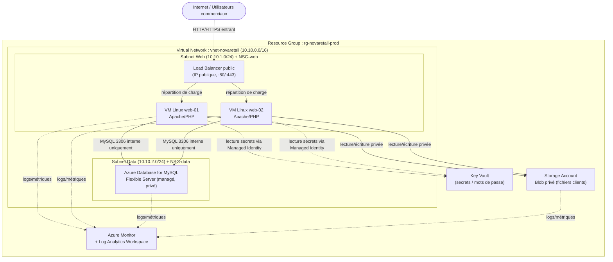

# Partie 1 — Analyse de l'existant et architecture cible

> **Cas NovaRetail** — migration d'une application web de gestion de commandes (serveur Linux unique on-premise) vers Microsoft Azure.
> **Barème : 3 pts** — pertinence de l'analyse, choix des services, schéma cohérent, justification des flux.

---

## Question 1 — Analyse de l'existant

L'architecture actuelle repose sur un **serveur Linux unique** hébergeant à la fois le serveur web Apache/PHP, la base MySQL et les fichiers clients. Cette concentration crée un **point de défaillance unique (SPOF)** et cumule les risques sur tous les domaines.

| Domaine | Risque identifié | Impact possible sur le SI |
|---|---|---|
| **Disponibilité** | Serveur unique = point de défaillance unique (SPOF). Aucune redondance, aucune répartition de charge. | Toute panne matérielle, coupure réseau ou maintenance entraîne une **indisponibilité totale** de l'application et l'arrêt de l'activité commerciale. |
| **Sécurité** | Accès administrateur partagé entre plusieurs personnes (pas de comptes nominatifs), aucune traçabilité, application + données + fichiers sur la même machine exposée. | **Aucune imputabilité** des actions, surface d'attaque élevée, risque de compromission complète (web, base et fichiers clients en un seul point) et fuite de données personnelles (RGPD). |
| **Performance** | Toutes les couches (web, base, stockage) partagent les mêmes ressources CPU/RAM/disque. Aucune capacité de montée en charge (scalabilité). | **Contention de ressources** : un pic de trafic web dégrade la base et inversement. Impossible d'absorber la croissance des équipes commerciales. |
| **Exploitation** | Pas de supervision ni de tableau de bord, administration manuelle, aucune Infrastructure as Code. | **Détection tardive** des incidents (panne constatée par les utilisateurs), diagnostic difficile, exploitation chronophage et non reproductible. |
| **Coûts** | Aucune estimation précise des coûts d'exploitation, pas de modèle de facturation clair (électricité, maintenance, amortissement matériel). | **Pilotage budgétaire impossible**, coûts cachés (énergie, remplacement matériel), pas d'arbitrage possible entre dépense et valeur. |
| **Sauvegarde** | Sauvegarde manuelle hebdomadaire, sur le même serveur ou à proximité, sans test de restauration. | **Perte de données pouvant atteindre 7 jours** (RPO élevé), risque de perte totale en cas de sinistre physique (les sauvegardes ne sont pas isolées), restauration non garantie. |

**Synthèse :** l'existant cumule un SPOF total, une sécurité non maîtrisée et une absence de supervision et de stratégie de sauvegarde fiable. La migration vers Azure doit prioritairement **séparer les couches**, **introduire de la redondance** et **industrialiser l'exploitation**.

---

## Question 2 — Choix des services Azure

Pour chaque besoin, le service est choisi selon les cinq critères de l'épreuve : **coût, sécurité, performance, disponibilité, exploitabilité**.

| Besoin | Service Azure proposé | Justification |
|---|---|---|
| **Hébergement applicatif** | **Machines virtuelles Linux** (VM Scale Set ou 2 VM identiques) derrière un répartiteur de charge | Le sujet impose explicitement « deux machines virtuelles Linux ». Deux VM réparties permettent la **haute disponibilité** (si une tombe, l'autre sert le trafic) et conservent la compatibilité Apache/PHP existante (migration « lift & shift » à faible risque). |
| **Réseau isolé** | **Azure Virtual Network (VNet)** avec subnets dédiés | Isole les ressources dans un réseau privé, permet la **segmentation** (web / données) et le contrôle fin des flux. Aucune ressource n'est exposée par défaut. Service gratuit (on ne paie que le trafic sortant). |
| **Filtrage réseau** | **Network Security Group (NSG)** par subnet | Filtrage stateful niveau 3/4 : on n'autorise que les flux nécessaires (HTTP/HTTPS entrant vers le web, MySQL **uniquement** depuis le subnet web vers la base, SSH restreint). Gratuit et indispensable à la sécurité. |
| **Stockage de documents** | **Azure Storage Account (Blob privé)** | Stockage objet **durable et redondant** (LRS/ZRS), découplé des VM (les fichiers clients ne sont plus sur le serveur applicatif). Accès privé, chiffrement au repos par défaut, versioning et soft delete activables. Coût très faible au Go. |
| **Base de données managée** | **Azure Database for MySQL — Flexible Server** | Remplace la base MySQL sur VM par un **service managé** : sauvegardes automatiques, patching, haute disponibilité zone-redondante, chiffrement, supervision intégrée. Décharge l'équipe de l'administration de la base et améliore disponibilité + sécurité. |
| **Supervision** | **Azure Monitor** (métriques + alertes) | Collecte centralisée des métriques (CPU, disponibilité, latence), création d'alertes et de tableaux de bord. Comble l'absence totale de supervision de l'existant. Facturation à l'usage. |
| **Gestion des coûts** | **Microsoft Cost Management + Budgets** | Suivi des dépenses par ressource/tag, **budgets avec alertes** de dépassement. Répond au besoin « mieux maîtriser les coûts » et au pilotage FinOps. Gratuit. |
| **Gestion des droits** | **Microsoft Entra ID + RBAC** (rôles intégrés, moindre privilège) | Remplace l'accès admin partagé par des **comptes nominatifs** et des rôles minimaux (Reader, Contributor ciblé, pas d'Owner généralisé). Apporte imputabilité et séparation des responsabilités. |
| **Journalisation / audit** | **Log Analytics Workspace + Azure Activity Log + diagnostic settings** | Centralise les journaux (système, accès, modifications de ressources via Activity Log), permet des requêtes KQL, l'audit et la corrélation. Support des alertes et de l'analyse a posteriori. |

> **Note FinOps / compte Azure for Students :** dans le déploiement réel (Partie 3), l'**Application Gateway** (≈ 125 $/mois) est remplacée par un **Load Balancer standard** (≈ 18 $/mois) — le sujet autorise « un Load Balancer **ou** une Application Gateway ». Les VM visaient une taille burstable `Standard_B1s` ; la famille `B` étant en restriction de capacité à swedencentral, le déploiement réel utilise `Standard_D2s_v3` (variable `vm_size` ajustable). Ces arbitrages coût/fonctionnalité sont assumés et documentés.

---

## Question 3 — Architecture cible

### Schéma d'architecture cible

> Le schéma exporté en PNG/PDF figure dans `schemas/` et `screenshots/` pour le rendu final.

### Description des flux

| Type de flux | Description | Contrôle |
|---|---|---|
| **Entrant** | Internet → Load Balancer (HTTP `:80`, HTTPS `:443`) → VM web | NSG-web : autorise `80/443` depuis Internet vers le subnet web uniquement. |
| **Interne (web → data)** | VM web → MySQL (`3306`) | NSG-data : autorise `3306` **uniquement** depuis le subnet web. Aucune exposition Internet. |
| **Interne (web → stockage)** | VM web → Storage Account (Blob privé) | Accès via endpoint privé / identité managée, pas d'accès public aux blobs. |
| **Administration** | Admin → VM via SSH (`22`) | NSG-web : SSH restreint à une plage d'IP d'administration connue (ou Azure Bastion), **jamais** `0.0.0.0/0`. |
| **Sortant / supervision** | VM, MySQL, Storage → Log Analytics / Azure Monitor | Diagnostic settings envoient métriques et journaux vers le workspace. |
| **Secrets** | VM → Key Vault | Lecture des secrets (mot de passe BDD) via **Managed Identity**, aucun secret en clair. |

### Justification courte des principaux choix

1. **Deux VM derrière un Load Balancer** : supprime le SPOF de l'existant et apporte la haute disponibilité exigée par la direction, tout en restant compatible avec l'application Apache/PHP actuelle.
2. **Base de données managée (Azure DB for MySQL Flexible)** : externalise la base de la VM, automatise sauvegardes et patching, et améliore sécurité et disponibilité sans surcharge d'exploitation.
3. **Segmentation réseau (2 subnets + NSG)** : sépare la couche web exposée de la couche données protégée ; la base n'est jamais accessible depuis Internet.
4. **Stockage Blob privé** : découple les fichiers clients du serveur applicatif, avec durabilité, chiffrement et accès privé.
5. **Azure Monitor + Log Analytics** : introduit la supervision et la traçabilité absentes de l'existant.
6. **Entra ID + RBAC + Key Vault** : remplace l'accès admin partagé par des comptes nominatifs à moindre privilège et sécurise les secrets.
