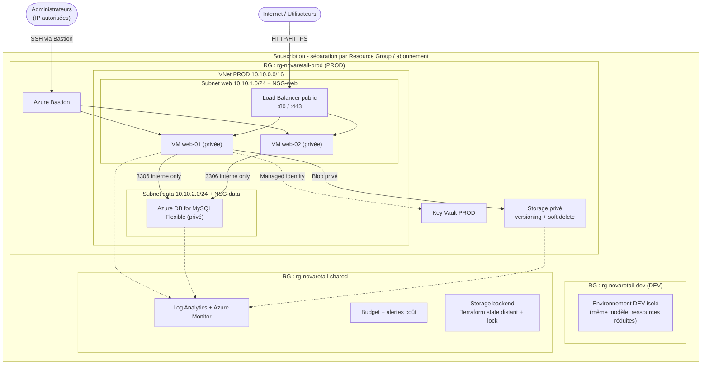

# Partie 2 — Diagnostic d'une architecture défectueuse

> Audit de l'architecture proposée par un prestataire externe pour NovaRetail, **avant mise en production**.
> **Barème : 3 pts** — identification des anomalies, priorisation, corrections proposées, plan de vérification.

---

## Question 4 — Identification des anomalies

Analyse des 18 caractéristiques de l'architecture proposée. **18 anomalies** identifiées (le sujet en demande au moins 12), classées par domaine : sécurité, disponibilité, exploitation, FinOps, gouvernance, Infrastructure as Code (IaC).

| No | Anomalie identifiée | Domaine | Risque principal |
|---|---|---|---|
| 1 | Un seul Resource Group `rg-prod-novaretail` mélange DEV et PROD | Gouvernance | Pas d'isolation des environnements : une erreur en DEV impacte la PROD, gestion des droits et du cycle de vie impossible. |
| 2 | Aucune séparation entre environnement de test et de production | Gouvernance | Tests destructeurs possibles sur la PROD, pas de promotion contrôlée des changements. |
| 3 | VNet unique `10.0.0.0/24` avec un seul subnet | Disponibilité / Sécurité | Aucune segmentation : web et base sur le même réseau, propagation latérale d'une compromission, plan d'adressage trop étroit (254 IP). |
| 4 | Les deux VM Linux ont une adresse IP publique | Sécurité | Surface d'attaque directe sur Internet, contournement de tout point d'entrée contrôlé. |
| 5 | Port SSH (`22`) ouvert depuis `0.0.0.0/0` | Sécurité | Exposition au brute-force et aux scans Internet, risque de prise de contrôle des VM. |
| 6 | Les deux VM web ne sont pas derrière un Load Balancer | Disponibilité | Pas de répartition de charge ni de bascule : SPOF persistant, pas de haute disponibilité réelle. |
| 7 | Base MySQL installée sur une VM dans le même subnet que le web | Sécurité / Disponibilité | Pas d'isolation des données, base non managée (pas de sauvegarde/patch auto), compromission web = accès direct base. |
| 8 | Port MySQL `3306` accessible depuis Internet | Sécurité | Exposition directe de la base de données : exfiltration ou destruction des données clients. |
| 9 | Mots de passe admin stockés dans `terraform.tfvars` versionné dans Git | Sécurité / IaC | **Fuite de secrets** : toute personne ayant accès au dépôt obtient les identifiants, historique Git impossible à purger. |
| 10 | State Terraform local sur le poste d'un administrateur | IaC | Perte du state = perte du contrôle de l'infra, pas de verrouillage (corruption si travail à plusieurs), pas de sauvegarde. |
| 11 | Storage Account autorise l'accès public aux blobs | Sécurité | Fichiers clients potentiellement accessibles publiquement : fuite de données personnelles (RGPD). |
| 12 | Versioning et soft delete désactivés sur le Storage Account | Disponibilité / Sécurité | Pas de récupération après suppression ou écrasement accidentel/malveillant des fichiers. |
| 13 | Aucune sauvegarde configurée | Disponibilité | Perte de données irréversible en cas d'incident, RPO/RTO non maîtrisés. |
| 14 | Aucun Log Analytics Workspace rattaché aux ressources | Exploitation | Pas de centralisation des journaux : diagnostic et audit impossibles. |
| 15 | Aucune alerte définie | Exploitation | Incidents détectés tardivement (par les utilisateurs), pas de réaction proactive. |
| 16 | Aucune stratégie de tags appliquée | FinOps / Gouvernance | Impossible d'attribuer les coûts, d'identifier propriétaire/criticité, gouvernance dégradée. |
| 17 | Aucun budget Azure configuré | FinOps | Pas d'alerte de dépassement : dérive budgétaire non détectée. |
| 18 | Plusieurs utilisateurs humains ont le rôle Owner sur la souscription | Sécurité / Gouvernance | Violation du moindre privilège : tout utilisateur peut tout faire (suppression, attribution de droits), pas d'imputabilité. |

---

## Question 5 — Priorisation des risques

Sélection des **5 risques les plus critiques** parmi les anomalies. La criticité combine la probabilité d'exploitation et la gravité de l'impact (fuite de données, indisponibilité, perte de contrôle).

| Risque critique | Niveau | Justification | Correction prioritaire |
|---|---|---|---|
| **Port MySQL 3306 exposé sur Internet** (anomalie 8) | **Critique** | Une base de données directement accessible depuis Internet est une cible de premier choix : scan automatisé, attaque par identifiants, exfiltration des données clients. Combiné à l'anomalie 7 (base sur VM non managée), l'impact est maximal (RGPD, perte totale de données). | Supprimer toute règle entrante `3306` depuis Internet. Placer la base dans un **subnet data isolé**, n'autoriser `3306` **que depuis le subnet web** via NSG. Migrer vers **Azure Database for MySQL Flexible Server** (privé). |
| **Secrets versionnés dans Git** (anomalie 9) | **Critique** | Les mots de passe administrateurs dans `terraform.tfvars` poussé sur Git sont exposés à tous les contributeurs et figés dans l'historique. Une fuite du dépôt = compromission immédiate de toute l'infrastructure. | Retirer `terraform.tfvars` du dépôt (`.gitignore`), **rotation immédiate** des secrets exposés, stockage dans **Azure Key Vault** + accès par **Managed Identity**. Purger l'historique Git si possible. |
| **SSH ouvert depuis 0.0.0.0/0** (anomalie 5) | **Élevé** | Toutes les VM sont attaquables en SSH depuis n'importe quelle IP mondiale : brute-force permanent, prise de contrôle possible. Aggravé par les IP publiques sur les VM (anomalie 4). | Restreindre `22` à une **plage d'IP d'administration** connue, ou supprimer l'accès SSH public au profit d'**Azure Bastion**. Retirer les IP publiques des VM. |
| **Owner multiple sur la souscription** (anomalie 18) | **Élevé** | Plusieurs Owners humains = aucune limite d'action, suppression accidentelle ou malveillante de ressources, attribution de droits incontrôlée, aucune imputabilité. | Appliquer le **moindre privilège RBAC** : un seul Owner de rupture, rôles **Contributor/Reader** ciblés par ressource, comptes nominatifs, revue d'accès périodique. |
| **Aucune sauvegarde + soft delete désactivé** (anomalies 12 et 13) | **Élevé** | En cas de panne, ransomware ou suppression accidentelle, **les données clients sont perdues définitivement**. Aucun moyen de restauration. | Activer les **sauvegardes automatiques** (Azure Backup pour VM, backups managés MySQL), **versioning + soft delete** sur le Storage Account, et **tester la restauration**. |

---

## Question 6 — Proposition d'architecture corrigée

L'architecture corrigée applique : séparation DEV/PROD, segmentation réseau, NSG adaptés, suppression des expositions Internet, base managée, secrets en Key Vault, state distant, supervision + sauvegardes + tags, et contrôle des coûts.

### Tableau des corrections par exigence

| Exigence du sujet | Correction apportée |
|---|---|
| Séparation DEV / PROD | Resource Groups distincts (`rg-novaretail-dev`, `rg-novaretail-prod`), idéalement abonnements séparés. Tags `environment`. |
| Segmentation réseau | VNet par environnement, **2 subnets** distincts (web `10.10.1.0/24`, data `10.10.2.0/24`). |
| Filtrage NSG adapté | NSG-web : `80/443` depuis Internet, `22` via Bastion uniquement. NSG-data : `3306` **uniquement** depuis subnet web. Deny par défaut. |
| Suppression expositions Internet | Retrait des IP publiques sur VM, fermeture de `3306` côté Internet, accès via Load Balancer et Bastion. |
| Base managée | Migration MySQL/VM → **Azure Database for MySQL Flexible Server** (privé, sauvegardes auto). |
| Gestion sécurisée des secrets | **Azure Key Vault** + **Managed Identity**, `terraform.tfvars` retiré de Git, rotation des secrets. |
| State Terraform distant | Backend distant **Azure Storage** avec verrouillage (lock) et chiffrement, dans `rg-novaretail-shared`. |
| Supervision, alertes, sauvegardes, tags | **Log Analytics + Azure Monitor**, alertes CPU/dispo/coût, **Azure Backup** + soft delete + versioning, stratégie de tags appliquée. |
| Contrôle des coûts | **Budget Azure** avec alertes, tags de coût, dimensionnement adapté, arrêt des ressources DEV hors heures. |

---

## Question 7 — Plan de vérification

Comment vérifier que les corrections sont **réellement appliquées** :

| Domaine | Vérification | Commande / méthode |
|---|---|---|
| **Réseau** | Confirmer qu'aucune règle NSG n'expose `3306` ou `22` depuis Internet, et que la base n'a pas d'IP publique. | `az network nsg rule list` (vérifier source ≠ `0.0.0.0/0` / `Internet` sur 22 et 3306) ; `az network public-ip list` (aucune IP publique sur les VM/base). |
| **Sécurité / RBAC** | Vérifier qu'il n'existe qu'un Owner et que les rôles suivent le moindre privilège. | `az role assignment list --all --query "[?roleDefinitionName=='Owner']"` ; revue des attributions par ressource. |
| **Terraform** | Confirmer que le state est distant et qu'aucun secret n'est versionné. | `terraform plan` (cohérence, pas de dérive) ; vérifier le backend `azurerm` dans le code ; `git grep -i password` / `git log` doit être vide de secrets ; `terraform.tfvars` dans `.gitignore`. |
| **Monitoring** | Vérifier que les ressources envoient leurs logs au workspace et que les alertes existent. | `az monitor diagnostic-settings list` ; `az monitor metrics alert list` (présence d'alertes CPU/dispo) ; dashboard Azure Monitor accessible. |
| **FinOps** | Confirmer la présence d'un budget avec alerte et des tags obligatoires. | `az consumption budget list` ; script d'audit des tags (cf. Partie 4) : aucune ressource sans tags `environment`, `owner`, `cost-center`. |

**Démarche générale :** chaque correction est tracée (capture + commande de vérification), et un contrôle de non-régression est rejoué via `terraform plan` pour garantir l'absence de dérive entre le code et l'infrastructure réelle.
