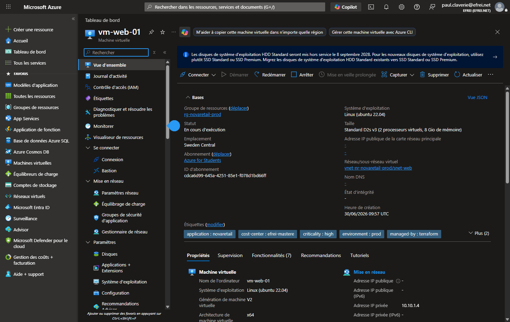

# Partie 3 — Déploiement et Infrastructure as Code

> Déploiement **réellement effectué** sur Azure (souscription **Azure for Students**, région **swedencentral**) via Terraform.
> **Barème : 4 pts** — structure Terraform, ressources attendues, variables, outputs, validation, clarté du code.

Le code complet se trouve dans le dossier [`infra/`](../infra/). Toutes les ressources ont été créées avec succès (`terraform apply`) et validées sur le portail Azure (captures ci-dessous).

---

## Question 8 — Organisation du projet Terraform

Le projet respecte la structure standard Terraform demandée :

| Fichier | Rôle |
|---|---|
| [`infra/main.tf`](../infra/main.tf) | Déclare le provider `azurerm` et **toutes les ressources** Azure (réseau, NSG, VM, Load Balancer, Storage, Log Analytics, base MySQL managée). Contient aussi la configuration de nommage (`locals`) et la génération de la clé SSH / mots de passe. |
| [`infra/variables.tf`](../infra/variables.tf) | Définit toutes les **variables d'entrée** (nom de projet, région, environnement, préfixe, adressage, taille de VM, tags) avec description et valeur par défaut. |
| [`infra/outputs.tf`](../infra/outputs.tf) | Expose les **valeurs utiles** après déploiement (nom du RG, IP publique, nom du Storage, URL applicative...). |
| [`infra/terraform.tfvars`](../infra/terraform.tfvars) | Fournit les **valeurs concrètes** des variables pour ce déploiement. **Ne contient aucun secret** (correction de l'anomalie 9 de la Partie 2) et est listé dans `.gitignore`. |
| [`infra/README.md`](../infra/README.md) | Explique **comment utiliser** le projet (prérequis, `init/plan/apply/destroy`, sécurité, FinOps). |
| [`infra/.gitignore`](../infra/.gitignore) | Empêche le versionnement du **state**, des **secrets** et des **clés SSH**. |

**Bonne pratique appliquée :** séparation claire entre la déclaration (`main.tf`), le paramétrage (`variables.tf` / `terraform.tfvars`) et la restitution (`outputs.tf`), ce qui rend le code lisible, réutilisable et reproductible sur plusieurs environnements.

---

## Question 9 — Ressources créées

Toutes les ressources demandées ont été déployées (14 ressources visibles dans le Resource Group) :

| Ressource demandée | Ressource Terraform | Nom réel déployé |
|---|---|---|
| Resource Group | `azurerm_resource_group.main` | `rg-novaretail-prod` |
| Virtual Network | `azurerm_virtual_network.main` | `vnet-nr-novaretail-prod` (`10.10.0.0/16`) |
| Subnet 1 (web) | `azurerm_subnet.web` | `snet-web` (`10.10.1.0/24`) |
| Subnet 2 (data) | `azurerm_subnet.data` | `snet-data` (`10.10.2.0/24`) |
| NSG règles HTTP/SSH | `azurerm_network_security_group.web` | `nsg-web` (80, 443, 22 restreint) |
| NSG base de données | `azurerm_network_security_group.data` | `nsg-data` (3306 depuis web, deny all) |
| 2 VM Linux | `azurerm_linux_virtual_machine.web[0..1]` | `vm-web-01`, `vm-web-02` (Ubuntu 22.04) |
| Load Balancer | `azurerm_lb.main` + règles/sonde/pool | `lb-nr-novaretail-prod` (Standard) |
| Storage Account | `azurerm_storage_account.main` | `stnovaretailja69ku` (privé) |
| Log Analytics Workspace | `azurerm_log_analytics_workspace.main` | `log-nr-novaretail-prod` |
| Base managée (bonus) | `azurerm_mysql_flexible_server.main` | `mysql-nr-novaretail-prod` (MySQL 8.0) |

### Choix d'arbitrage documentés

- **Load Balancer standard plutôt qu'Application Gateway** : le sujet autorise « Load Balancer **ou** Application Gateway ». L'Application Gateway coûte ~125 $/mois (incompatible avec un budget Students) ; le Load Balancer standard (~18 $/mois) assure la même fonction de haute disponibilité pour ce périmètre. Une **règle de sortie (outbound rule)** a été ajoutée pour fournir le SNAT permettant aux VM (sans IP publique) d'accéder à Internet (mises à jour, cloud-init).
- **Taille de VM `Standard_D2s_v3`** : la famille `B` (burstable, la moins chère) était en **restriction de capacité** à swedencentral au moment du déploiement (`SkuNotAvailable`). La taille `Standard_D2s_v3` a été retenue comme alternative disponible. La variable `vm_size` permet de revenir à une taille burstable dès que la capacité est rétablie.
- **VM sans IP publique** : conformément à la correction de la Partie 2, les VM n'ont **pas d'adresse IP publique** ; elles ne sont accessibles que via le Load Balancer (HTTP) et, pour l'administration, via SSH restreint au VNet (idéalement Azure Bastion).

---

## Question 10 — Variables et outputs

### Variables (toutes celles exigées par le sujet)

| Élément demandé | Variable Terraform | Valeur par défaut |
|---|---|---|
| Nom du projet | `project_name` | `novaretail` |
| Région Azure | `location` | `swedencentral` |
| Environnement | `environment` | `prod` |
| Préfixe de nommage | `prefix` | `nr` |
| Plage d'adressage du VNet | `vnet_address_space` | `["10.10.0.0/16"]` |
| Taille des VM | `vm_size` | `Standard_D2s_v3` |

Variables additionnelles : `web_subnet_prefix`, `data_subnet_prefix`, `vm_count`, `admin_username`, `admin_source_address`, `deploy_mysql`, `tags`.

### Outputs (≥ 3 exigés, 8 fournis)

```text
resource_group_name          = "rg-novaretail-prod"
load_balancer_public_ip      = "20.91.200.239"
storage_account_name         = "stnovaretailja69ku"
web_application_url          = "http://20.91.200.239"
log_analytics_workspace_name = "log-nr-novaretail-prod"
vm_names                     = ["vm-web-01", "vm-web-02"]
mysql_server_name            = "mysql-nr-novaretail-prod"
ssh_private_key              = <sensitive>
```

---

## Question 11 — Validation du déploiement

### Preuve d'idempotence / reproductibilité (C22.2)

Après `apply`, un `terraform plan` rejoué confirme l'absence de dérive :

```text
No changes. Your infrastructure matches the configuration.
Terraform has compared your real infrastructure against your configuration
and found no differences, so no changes are needed.
```

### Captures de validation (portail Azure)

**1. Resource Group `rg-novaretail-prod`** — les 14 ressources déployées


**2. Virtual Network et subnets** — `snet-web` (10.10.1.0/24, NSG web) et `snet-data` (10.10.2.0/24, délégué à MySQL)


**3. Règles NSG `nsg-web`** — HTTP 80 / HTTPS 443 depuis Internet, SSH 22 restreint à `VirtualNetwork` (pas de `0.0.0.0/0`)


**4. Machine virtuelle `vm-web-01`** — Ubuntu 22.04, en cours d'exécution, **sans IP publique**, IP privée `10.10.1.4`, tags appliqués



**5. Point d'entrée HTTP** — l'application répond (HTTP 200) via l'IP publique du Load Balancer ; la page personnalisée déployée par cloud-init s'affiche et le trafic est routé vers `vm-web-02`


**6. Load Balancer `lb-nr-novaretail-prod`** — SKU Standard, backend pool de 2 VM, règle HTTP (Tcp/80), sonde de santé, règle de sortie


**7. Storage Account `stnovaretailja69ku`** — **accès anonyme aux blobs désactivé**, TLS 1.2 minimum, réplication LRS


**8. Base de données managée `mysql-nr-novaretail-prod`** — MySQL 8.0 Flexible Server, statut *Ready*, sauvegardes automatiques


> Les sorties brutes Azure CLI correspondantes (inventaire, règles NSG, état des VM, test HTTP, configuration Storage/MySQL, outputs et plan Terraform) sont archivées dans [`screenshots/cli-evidence/`](../screenshots/cli-evidence/).

### Limites rencontrées

- **Capacité VM** : la famille `B` étant indisponible à swedencentral, la taille a été ajustée (`D2s_v3`). C'est une contrainte de capacité régionale, pas une erreur de code.
- **Accès réseau au Storage** : pour permettre la création du conteneur depuis le poste d'exécution, `public_network_access_enabled` reste activé tout en **désactivant l'accès anonyme aux blobs**. En production réelle, un **Private Endpoint** serait ajouté (documenté dans `main.tf`).
- **State local** : pour cette épreuve le state est local ; le bloc `backend "azurerm"` (state distant chiffré et verrouillé) est fourni en commentaire dans `main.tf`, prêt à être activé.
