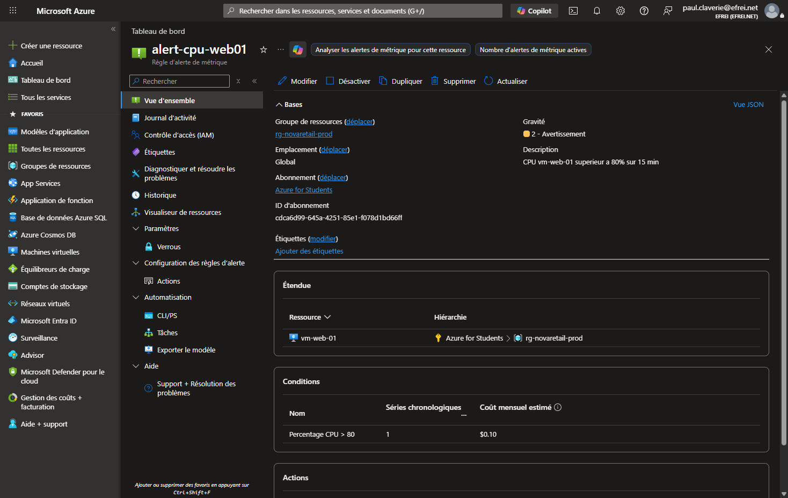

# Partie 5 — Monitoring, FinOps et sécurité

> Dispositif de supervision, analyse FinOps, revue de sécurité et note DSI, appuyés sur des ressources **réellement configurées** (alertes, budget).
> **Barème : 5 pts** — métriques, alertes, coûts, risques, mesures correctives, plan d'action.

---

## Question 15 — Monitoring et alertes

### Tableau de supervision

| Élément surveillé | Métrique / log | Seuil | Action attendue |
|---|---|---|---|
| **Disponibilité applicative** | Sonde de santé du Load Balancer (`Health Probe Status`) + `Availability` Storage | < 100 % des nœuds sains, dispo < 99 % | Alerte sévérité 1 à l'équipe Ops ; vérifier les VM, basculer le trafic, redémarrer le nœud défaillant. |
| **CPU VM** | `Percentage CPU` (vm-web-01 / vm-web-02) | > 80 % pendant 15 min | Alerte sévérité 2 ; analyser la charge, envisager l'ajout d'un nœud (scale-out). |
| **Base de données** | `cpu_percent` / `storage_percent` (MySQL Flexible) | CPU > 80 % ou stockage > 85 % | Alerte ; optimiser les requêtes, augmenter le tier ou le stockage. |
| **Stockage** | `Availability` / `UsedCapacity` (Storage Account) | dispo < 99 % | Alerte sévérité 1 ; vérifier l'état du service et les accès. |
| **Coût** | Budget Azure (dépense réelle / prévisionnelle) | > 80 % du budget (réel), > 100 % (prévision) | Notification e-mail à l'owner ; analyser les postes, arrêter les ressources inutiles. |

### Alertes réellement configurées (≥ 2 exigées)

Deux règles d'alerte de métrique ont été **créées sur l'infrastructure déployée** :

| Alerte | Ressource | Condition | Sévérité | Action |
|---|---|---|---|---|
| `alert-cpu-web01` | vm-web-01 | `Percentage CPU > 80` (15 min) | 2 (Avertissement) | Groupe d'actions `ag-novaretail-ops` (e-mail) |
| `alert-storage-availability` | stnovaretailja69ku | `Availability < 99` | 1 (Critique) | Groupe d'actions `ag-novaretail-ops` (e-mail) |

### Tableau de bord, logs et destinataires

- **Tableau de bord d'exploitation** : Azure Monitor + les graphiques de métriques intégrés à chaque ressource (CPU, E/S, connexions BDD, disponibilité). Le **Log Analytics Workspace** `log-nr-novaretail-prod` centralise les journaux pour des requêtes KQL et un dashboard partagé.
- **Logs / workspace** : `log-nr-novaretail-prod` (rétention 30 j) reçoit les journaux des VM, de la base et du stockage via les *diagnostic settings*.
- **Destinataires** : le **groupe d'actions `ag-novaretail-ops`** notifie l'équipe Ops (e-mail `paul.claverie@efrei.net`). En production : liste de diffusion Ops + astreinte (SMS / webhook vers un outil d'incident).

---

## Question 16 — Analyse FinOps

### Principaux postes de coût

| Poste | Service | Poids estimé |
|---|---|---|
| Calcul | 2 VM Linux (`Standard_D2s_v3`) | Élevé (poste dominant) |
| Réseau | Load Balancer Standard + IP publique + trafic sortant | Moyen |
| Base de données | Azure DB for MySQL Flexible (B1ms) | Moyen |
| Stockage | Storage Account (Blob, LRS) | Faible |
| Supervision | Log Analytics (ingestion par Go) | Faible à moyen (selon volume de logs) |

### Risques de dépassement budgétaire

- VM surdimensionnées ou laissées allumées en permanence (notamment en DEV).
- Ingestion de logs non maîtrisée dans Log Analytics (facturation au Go).
- Trafic sortant et IP publiques multipliées.
- Absence de nettoyage des ressources de test (ressources orphelines).

### Tags nécessaires au suivi

`environment`, `application`, `cost-center`, `owner` (cf. Partie 4) — indispensables pour ventiler la facture par environnement et par application dans Cost Management.

### Budget / alerte de coût (réellement configuré)

Un **budget mensuel de 50 €** a été créé sur le Resource Group avec deux notifications : **80 % de la dépense réelle** et **100 % de la dépense prévisionnelle**.

### Pistes d'optimisation

**Court terme (3) :**
1. **Arrêter les ressources DEV** hors heures ouvrées (auto-shutdown des VM) — économie immédiate.
2. **Redimensionner les VM** vers une taille burstable (famille `B`) dès que la capacité régionale le permet — les VM web ont une charge faible et variable.
3. **Plafonner la rétention / le volume Log Analytics** (30 j, filtrer les logs verbeux) pour maîtriser l'ingestion.

**Moyen terme (2) :**
1. **Réservations / Savings Plans** (1 an) sur le calcul stable de production — jusqu'à ~40 % d'économie.
2. **Mutualiser et automatiser** : VM Scale Set avec autoscaling pour ne payer que la capacité réellement utilisée selon la charge.

---

## Question 17 — Revue sécurité

Couverture : RBAC, accès administrateur, exposition réseau, NSG, stockage, base de données, journaux d'audit, chiffrement, sauvegarde, gestion des secrets.

| Risque | Description | Criticité | Mesure corrective |
|---|---|---|---|
| **Accès trop ouverts** | Exposition réseau de la couche applicative et d'administration (SSH/HTTP). | Élevée | NSG : HTTP/HTTPS via Load Balancer uniquement, **SSH restreint** au VNet/Bastion (vérifié : source `VirtualNetwork`, pas de `0.0.0.0/0`). VM **sans IP publique**. |
| **Absence de logs** | Sans journalisation, ni audit ni diagnostic possible. | Moyenne | **Log Analytics Workspace** rattaché + Activity Log + diagnostic settings sur VM, base et stockage. |
| **Droits excessifs (RBAC)** | Trop d'Owners, droits non minimaux. | Élevée | **RBAC moindre privilège** : un seul Owner de rupture, rôles ciblés (Reader/Contributor par ressource), comptes nominatifs, revue d'accès. |
| **Données mal protégées** | Stockage/base exposés ou non chiffrés. | Élevée | Storage : **accès anonyme aux blobs désactivé**, **TLS 1.2** min, chiffrement au repos par défaut. Base **managée privée** (3306 interne seulement). |
| **Sauvegarde insuffisante** | Pas de sauvegarde = perte de données. | Élevée | **Sauvegardes automatiques MySQL** (rétention 7 j), **soft delete + versioning** sur le Storage, Azure Backup pour les VM, tests de restauration. |

Compléments de revue :

- **Accès administrateur** : suppression de l'accès partagé ; comptes nominatifs Entra ID, SSH par clé (générée par Terraform, aucun mot de passe en clair).
- **Chiffrement** : au repos (Storage, disques, MySQL) et en transit (TLS 1.2, HTTPS, SSL MySQL).
- **Gestion des secrets** : mots de passe et clés via **Key Vault + Managed Identity** ; `terraform.tfvars` retiré de Git (`.gitignore`), aucun secret versionné.

---

## Question 18 — Note de recommandations DSI

> **Note à la DSI — Migration NovaRetail vers Azure**

**1. Résumé de l'architecture retenue**
Migration du serveur unique on-premise vers une architecture Azure segmentée : un Resource Group dédié, un Virtual Network avec deux subnets (web / données), deux VM Linux derrière un Load Balancer, une base **Azure Database for MySQL managée**, un Storage Account privé pour les fichiers clients, et une supervision via Azure Monitor + Log Analytics. Les secrets sont gérés par Key Vault, les accès par RBAC moindre privilège.

**2. Bénéfices attendus**
- **Disponibilité** : suppression du point de défaillance unique (2 VM + Load Balancer).
- **Sécurité** : isolation réseau, base non exposée, accès admin nominatifs, chiffrement, journalisation.
- **Exploitabilité** : infrastructure reproductible (Terraform), supervision et alertes proactives.
- **Maîtrise des coûts** : tags + budget + alertes, dimensionnement adapté.

**3. Risques résiduels**
- Déploiement mono-région (pas de reprise inter-région).
- State Terraform local lors de l'épreuve (backend distant à activer en production).
- Storage accessible via réseau public (Private Endpoint recommandé en production).
- Pas encore de WAF (Application Gateway/Front Door) ni de Defender for Cloud activé.

**4. Arbitrages coût / performance / sécurité**
- **Load Balancer standard** plutôt qu'Application Gateway (économie ~100 $/mois) : suffisant pour le périmètre, mais sans WAF — à réévaluer si exposition de données sensibles.
- **VM `D2s_v3`** par contrainte de capacité régionale : à redimensionner en burstable pour réduire le coût.
- **Base managée** : léger surcoût vs VM, mais gain majeur en sécurité, sauvegarde et exploitation.

**5. Plan d'action priorisé**
1. *(Immédiat)* Activer le **backend Terraform distant** et Key Vault pour tous les secrets.
2. *(Court terme)* Activer **Azure Backup** sur les VM et tester une restauration ; mettre l'auto-shutdown sur DEV.
3. *(Court terme)* Activer **Microsoft Defender for Cloud** (posture de sécurité) et **Azure Bastion** pour l'admin.
4. *(Moyen terme)* Ajouter un **WAF** (Application Gateway/Front Door) et un **Private Endpoint** sur le Storage et la base.
5. *(Moyen terme)* Étudier la **redondance multi-zone** et les **réservations** pour le coût.

**6. Limites de la proposition**
Périmètre adapté à un compte **Azure for Students** (budget et capacité limités) : certaines options de production (WAF, multi-zone, Private Endpoints, Defender payant) sont **documentées mais non activées**. Le dimensionnement devra être affiné avec les volumes réels de NovaRetail.
