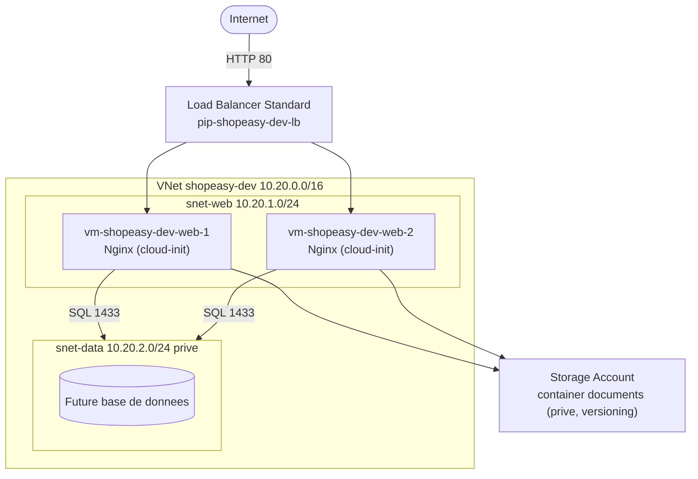

# TP2 Terraform — Note technique

> Synthèse des choix d'industrialisation de l'infrastructure ShopEasy avec Terraform sur Azure.

---

## 1. Objectif

Transformer l'architecture conçue au TP1 (réalisée manuellement via le portail) en **infrastructure déclarative**, reproductible, versionnée et destructible. Le code Terraform devient la source de vérité de l'environnement de développement ShopEasy, et la base des futurs environnements de recette et de production.

## 2. Architecture déployée



Composants : 1 Resource Group, 1 VNet, 2 subnets (web + data privé), 2 NSG, 2 VM Linux Ubuntu, 3 IP publiques, 1 Load Balancer, 1 Storage Account + container privé.

## 3. Choix techniques

| Choix | Justification |
|---|---|
| **Provider `azurerm ~> 4.0`** | Standard Azure, lisible, documenté ; `random` pour l'unicité du Storage |
| **Découpage par responsabilité** (`network`/`security`/`compute`/`loadbalancer`/`storage`) | Lisibilité, revue de code, limitation des conflits Git |
| **Variables + `locals`** | Aucune valeur en dur ; réutilisable multi-environnement ; tags centralisés |
| **`count = 2`** sur VM/NIC/IP | Redondance web sans duplication de code |
| **cloud-init via `templatefile`** | Provisioning automatique de Nginx, page personnalisée par serveur |
| **Load Balancer Standard + probe** | Suppression du SPOF web, bascule automatique sur VM saine |
| **Storage container privé + versioning + TLS 1.2** | Confidentialité des documents métier, protection contre suppression accidentelle |
| **Tags `common_tags`** | Gouvernance et FinOps (`project`, `environment`, `owner`, `managed_by`, `cost_center`) |
| **Subnet `snet-data` privé (option A)** | Segmentation réseau, préparation d'une couche données isolée |

## 4. Conventions de nommage

`<type>-<projet>-<environnement>[-<role>][-<index>]` → `rg-shopeasy-dev`, `vnet-shopeasy-dev`, `snet-web`, `nsg-shopeasy-dev-web`, `vm-shopeasy-dev-web-1`, `pip-shopeasy-dev-lb`. Le Storage Account suit la contrainte Azure (minuscules/chiffres, unicité globale) : `shopeasydevdocs<suffixe-aléatoire>`.

## 5. Adaptations liées à la souscription Azure for Students

| Contrainte | Valeur sujet | Valeur retenue | Raison |
|---|---|---|---|
| Région | `francecentral` | **`swedencentral`** | Policy Students interdisant `francecentral` |
| Gabarit VM | `Standard_B1s` | **`Standard_B2ts_v2`** | `B1s` indisponible (capacité) sur la souscription |

Ces valeurs sont **paramétrées** (variables `location`, `vm_size`) : le passage à `francecentral`/`B1s` sur une souscription standard ne nécessite qu'un changement de `terraform.tfvars`.

## 6. Sécurité et gestion des secrets

- Aucun secret dans le code : seule la **clé SSH publique** est référencée par chemin (`file(var.ssh_public_key_path)`).
- `terraform.tfvars` et le **state** sont ignorés par Git (`.gitignore`).
- SSH restreint à `allowed_ssh_cidr` ; Storage privé ; subnet data sans IP publique.
- En production : backend `azurerm` distant chiffré (RBAC), Azure Key Vault, Bastion, Application Gateway + WAF.

## 7. Cycle de vie et reproductibilité

```bash
terraform init      # telecharge providers
terraform fmt       # formate
terraform validate  # verifie
terraform plan      # previsualise
terraform apply     # deploie
terraform output    # IP LB, RG, Storage
terraform destroy   # nettoie (obligatoire en fin de seance)
```

## 8. Limites et évolutions

Environnement volontairement minimal (pédagogique). Évolutions vers la production : suppression des IP publiques des VM + Bastion, state distant, Application Gateway + WAF, Azure SQL managé avec private endpoint dans `snet-data`, observabilité (Azure Monitor / Log Analytics), modularisation Terraform et pipeline CI/CD (`fmt`/`validate`/`plan`/`tfsec`/`infracost`/approbation).
