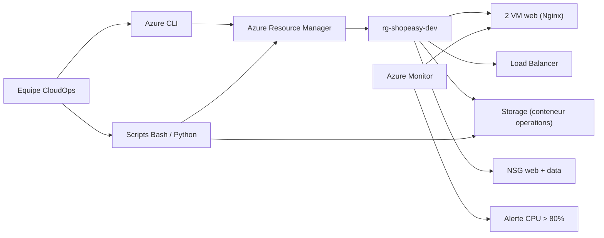

# Note technique — Exploitation de ShopEasy sur Azure (TP3)

> Synthèse à destination d'une équipe CloudOps reprenant l'administration de l'environnement.

## Objet

Cette note résume le passage d'une logique de **déploiement** (TP1/TP2) à une logique d'**exploitation**. L'infrastructure ShopEasy (déployée par Terraform) est désormais administrée, inventoriée, supervisée et optimisée par des commandes reproductibles et des scripts relançables, sans dépendre du portail Azure.

## Choix techniques

- **Azure CLI** comme outil central d'administration : commandes scriptables, sorties JSON/table/TSV exploitables.
- **Scripts Bash** (`inventory.sh`, `vm-power.sh`, `healthcheck.sh`) pour les tâches récurrentes, avec `set -euo pipefail`, gestion d'erreur, confirmation des actions destructives et journalisation.
- **Python + SDK Azure** (`inventory.py`) pour produire un inventaire structuré et un CSV exploitable en tableur.
- **Azure Monitor** pour la supervision (métrique CPU + alerte seuil).
- **Tags d'exploitation** appliqués en mode `Merge` pour préserver l'état Terraform.
- **Sécurité** : authentification Entra ID pour le stockage (pas de clés), accès public désactivé, SSH restreint, garde-fou anti-production dans les scripts.

## Architecture d'exploitation

## Adaptation à l'environnement réel

| Variable sujet | Valeur réelle |
|---|---|
| `LOCATION` | `swedencentral` (policy *Azure for Students*, `francecentral` interdite) |
| `VM1` / `VM2` | `vm-shopeasy-dev-web-1` / `vm-shopeasy-dev-web-2` |
| `STORAGE` | `shopeasydevdocsa0rnay` (suffixe aléatoire Terraform) |
| `CONTAINER` | `operations` (créé au TP3) |

## Points de vigilance

- `az vm stop` ne stoppe pas la facturation compute : utiliser `deallocate`.
- `az vm update --set tags` échoue sur cette souscription (« zone movement ») : préférer `az tag update --operation Merge`.
- L'auth `--auth-mode login` du stockage exige un rôle data-plane RBAC.
- Les commandes sont rejouables et les scripts sont versionnés : aucune action n'est « one-shot » non documentée.

## Conclusion

L'environnement est exploitable par un tiers à partir du mini-kit livré (scripts + variables + rapport). Les écarts restants (tags incomplets, budget à définir) sont identifiés et priorisés dans le rapport d'exploitation.
